# Gatsby와 React로 만드는 블로그
> 강의 : https://www.youtube.com/watch?v=8t0vNu2fCCM
>
> 본 글은 상단의 "Andrew Mead"의 강의를 듣고, 정리를 위해 내용을 추가하여 작성한 글입니다.

<br>

<details>
  <summary>
    <strong>목차</strong>
  </summary>
  <p>
    1. Creating a Gatsby Site<br>
    2. Working with Gatsby Pages<br>
    3. Linking Between Pages with Gatsby<br>
    4. Creating Shared Page Components<br>
    5. Creating Gatsby Page Layouts<br>
    6. Styling Gatsby Projects<br>
    7. Styling Gatsby with CSS Modules<br>
    8. Gatsby Data with GraphQL<br>
    9. GraphQL Playground<br>
    10. Sourcing Content from the File System<br>
    11. Working with Markdown Posts<br>
    12. Generating Slugs for Posts<br>
    13. Dynamically Generating Pages<br>
    14. Rendering Post Data in Blog Template<br>
    15. Adding Images to Posts<br>
    16. Getting Started with Contentful<br>
    17. Rendering Contentful Posts<br>
    18. Dynamic Pages from Contentful<br>
    19. 404 Pages and React Helme<br>
    20. Deploying Your Gatsby Site<br>
  </p>
</details>

## 📌 Gatsby와 블로그

### 나의 블로그 연대기

처음 블로그는 [jekyll](https://jekyllrb-ko.github.io/)을 사용하여 블로그를 만들었다. 그러다 얼마 지나지 않아 [HEXO](https://hexo.io/ko/index.html)와 [VEXO](https://github.com/yanm1ng/hexo-theme-vexo)테마로 넘어가게 되었는데, 한창 Node와 Vue를 공부할 때였다. 

이번에 [Gatsby](https://www.gatsbyjs.org/)로 넘어오게 된 이유도 이전과 같다. React를 공부하다 보니 React를 사용하여 나만의 블로그를 만들어보고 싶어졌다. 이전에 테마를 조금 수정하여 블로그를 만이번에는 테마를 최소화하여 진짜 **"나만의 블로그"**를 만들어 보려 한다.

<br>

### Gatsby에 대하여

 [**Gatsby**](https://www.gatsbyjs.org/)는 **React**와 **GraphQL**을 이용하여 웹 사이트와 웹 앱을 만들기 쉽게 제작할 수 있는 **프레임워크**다. Gatsby는 우리가 아는 정적인 웹을 만들수 있을 뿐만 아니라 동적인 웹 앱을 만드는데 모두 쓰인다.

Gatsby를 이용하여 웹을 생성할 때는 React와 GraphQL이 주를 이루기 때문에, 이 둘에 대한 지식이 어느 정도 있어야 원하는 방향으로 웹을 제작할 수 있다. 하지만 현재 블로그 만들기에서는 아직 GraphQL에 대해 깊게 다루지 않기 때문에 어느 정도의 React지식만 있어도 충분히 원하는 대로 블로그를 만들 수 있다.


<br>

## <a name="number1">✏️ 1. Gatsby로 블로그 만들기</a>

Gatsby를 설치하기 위한 명령어는 다음과 같다. **gatsby-cli**를 설치하고, gatsby 명령어를 통해 원하는 블로그(혹은 프로젝트) 이름으로 프로젝트를 생성한다. 이 때 [gastby-starter](https://github.com/gatsbyjs/gatsby-starter-hello-world)를 이용하면 좀 더 쉽게 기본적인 세팅을 한다.

```bash
npm install -g gatsby-cli
gatsby new gatsby-practice https://github.com/gatsbyjs/gatsby-starter-hello-world
```

여러 파일들과 폴더가 생겼다. 여기서 `package.json`을 열어보면 다음과 같은 명령어들이 존재하는 것을 확인할 수 있다.

```json
"scripts": {
  "build": "gatsby build",
  "develop": "gatsby develop",
  "format": "prettier --write src/**/*.{js,jsx}",
  "start": "npm run develop",
  "serve": "gatsby serve",
  "test": "echo \"Write tests! -> https://gatsby.dev/unit-testing\""
}
```

아래와 같은 명령어로 서버를 실행할 수 있다.

```bash
npm run develop
```

 사실 `npm run develop`과 `gatsby develop`은 동일한 

```bash
npm run develop

> gatsby-starter-hello-world@0.1.0 develop /Users/soonho/project/jsnow-blog
> gatsby develop

success open and validate gatsby-configs - 0.005 s
success load plugins - 0.035 s
```


localhost를 실행해보면 Hello world라는 문구를 확인할 수 있다.

```bash
You can now view gatsby-starter-hello-world in the browser.
⠀
  http://localhost:8000/
⠀
View GraphiQL, an in-browser IDE, to explore your site's data and schema
⠀
  http://localhost:8000/___graphql
⠀
Note that the development build is not optimized.
To create a production build, use npm run build
```

`src/pages`에는 앞으로 만들 페이지들을 담으면 된다. 기본적으로 `index.js`가 생성되어 있다. 다음과 같이 수정하고 저장하면 화면에 원하는 문구가 출력된다.

```javascript
import React from "react"

const IndexPage = () => {
  return (
    <div>
      <h1>Hello.</h1>
      <h2>I'm JSnow! Front-end developer, I'm learning React!</h2>
    </div>
  )
}

export default IndexPage
```

여기서 `index.js`는 우리가 흔히 보는 `index.html`과 동일한 역할을 한다.

`src/pages`에 `blog.js`를 생성한다. 저장후 `localhost:8000/blog`으로 접속하면 우리가 출력하고자 했던 문구를 볼 수 있다.

```javascript
import React from "react"

const BlogPage = () => {
  return (
    <div>
      <h1>Blog</h1>
      <p>Posts will show up here later on</p>
    </div>
  )
}

export default BlogPage
```

이제 블로그 페이지 외에도 `contact.js`와 `about.js`페이지를 만들어 준다.

```javascript
// about.js
import React from "react"

const AboutPage = () => {
  return (
    <div>
      <h1>About me</h1>
      <p>I'm just student who love front-end and design</p>
    </div>
  )
}

export default AboutPage

// contact.js
import React from "react"

const ContactPage = () => {
  return (
    <div>
      <h1>Contact</h1>
      <p>Contact me !</p>
    </div>
  )
}

export default ContactPage
```

gatsby에서 링크는 일반적인 우리가아는 앵커(`<a>`)를 이용하는 것 보다 `gatsby`모듈에 있는 `Link` 컴포넌트 이용한다. 이를 이용하면 최적화가 자동으로 이루어진다. 화면 전환시 반짝거리는 로드가 없어진다. 
아래의 두 태그를 직접 눌러보면 `Link`컴포넌트가 더 빠른 것을 알 수 있다.

```javascript
import React from "react"
import { Link } from "gatsby"

const AboutPage = () => {
  return (
    <div>
      <h1>About me</h1>
      <p>I'm just student who love front-end and design</p>
      <p>
        Need a developer? <a href="/contact">Contact me.</a>
      </p>
      <p>
        Need a developer? <Link to="/contact">Contact me.</Link>
      </p>
    </div>
  )
}

export default AboutPage
```

이제는 모든 페이지에서 공통으로 보이는 header과 footer를 만들어 보려고 한다.

`src/components`폴더를 만들어주고 거기에 `footer.js`를 생성한다.

```javascript
import React from "react"

const Footer = () => {
  return (
    <footer>
      <p>Created by JSnow, © 2019</p>
    </footer>
  )
}

export default Footer
```

아까 이미 완성한 Contact페이지에 만들어진 Footer를 한 번 import 해본다.

```javascript
import React from "react"
import Footer from "../components/footer"

const ContactPage = () => {
  return (
    <div>
      <h1>Contact</h1>
      <p>
        Contact me with <a href="mailto:asdka4618@gmail.com"></a>!
      </p>
      <Footer />
    </div>
  )
}

export default ContactPage
```

이번에는 Header를 만들어주는데 역시나 `Link`컴포넌트를 사용한다.

```javascript
import React from "react"
import { Link } from "gatsby"

const Header = () => {
  return (
    <header>
      <h1>JSnow</h1>
      <nav>
        <ul>
          <li>
            <Link to="/">Home</Link>
          </li>
          <li>
            <Link to="/blog">Blog</Link>
          </li>
          <li>
            <Link to="/about">About</Link>
          </li>
          <li>
            <Link to="/contact">Contact</Link>
          </li>
        </ul>
      </nav>
    </header>
  )
}

export default Header
```

`IndexPage`에 `Header`와 `Footer`를 넣어준다.

```javascript
import React from "react"

import Header from "../components/header"
import Footer from "../components/footer"

const IndexPage = () => {
  return (
    <div>
      <Header />
      <h1>Hello.</h1>
      <h2>I'm JSnow! Front-end developer, I'm learning React!</h2>
      <Footer />
    </div>
  )
}

export default IndexPage
```

이렇게 `Header`과 `Footer`를 적용하고보니 모든 페이지에서도 `Header`와 `Footer`를 보이게 하고 싶다. 
이를 위해서 `src/components`에 `layout.js`를 만든다.
`IndexPage`에 있던 `Header`와 `Footer`를 옮길 것이기 때문에 지워주고 `Layout`만 `import`하고 나머지는 지워준다. 그리고 `Layout`으로 원래 있던 문구를 인자로 전달한다.

```javascript
import React from "react"

import Layout from "../components/layout"

const IndexPage = () => {
  return (
    <div>
      <Layout>
        <h1>Hello.</h1>
        <h2>I'm JSnow! Front-end developer, I'm learning React!</h2>
      </Layout>
    </div>
  )
}

export default IndexPage
```

이제 `Layout`을 만든다. 아까 넘겨받은 인자를 `props.children`으로 뿌려준다. 아까 다른 페이지에 넣은 중복된 코드들을 제거해주고 모든 페이지에 `Layout` 을 추가하고 내용들을 모두 인자로 넘겨준다.

```javascript
import React from "react"

import Header from "../components/header"
import Footer from "../components/footer"

const Layout = props => {
  return (
    <div>
      <Header />
      {props.children}
      <Footer />
    </div>
  )
}

export default Layout
```

이제 어느정도 블로그의 틀은 잡았다. 하지만 아직 디자인으로 아무것도 없기 때문에 예쁘지 않다. 꾸며주기 위해 `src/styles`를 만들고 `index.css`파일도 만든다. 테스트를 위해 모든 글자를 빨간색으로 만들어본다.

```css
*{
  color: red;
}
```

`Layout`에 한 줄만 추가하면 쉽게 style을 적용할 수 있다.

```javascript
import "../styles/index.css"
```

하지만 그냥 CSS를 쓰는 것보다 좀 더 편하고 유용한 SASS를 쓰는 것이 더 좋을 것 같기 때문에 gatsby의 plugin을 한 번 써보려고 한다. gatsby는 gatsby만의 유용한 plugin들을 제공하고 있다.
플러그인은 Gatsby에서 [plugins](https://www.gatsbyjs.org/plugins/) 검색해서 설치 방법을 확인 할 수 있다. sass를 검색하고 설명에 따라 플러그인을 설치한다.


플러그인을 설치하고, 루트 디렉토리에 `gatsby-config.js`에 문서를 따라 세팅해준다.
```bash
npm install --save node-sass gatsby-plugin-sass
```

```javascript
module.exports = {
  // in gatsby-config.js
  plugins: [`gatsby-plugin-sass`],
}
```

그리고 `index.css`의 확장자를 `scss`로 바꿔주고 `Layout`에 있던 `import`역시 바꿔준다.

```javascript
import "../styles/index.scss"
```

기본적인 스타일을 적용하기 위해 gatsby에서 제공하는 [기본 블로그 스타일](http://links.mead.io/gatsbystyles)을 가져온다. `index.scss`에 붙여넣기 하여 스타일을 적용한다.

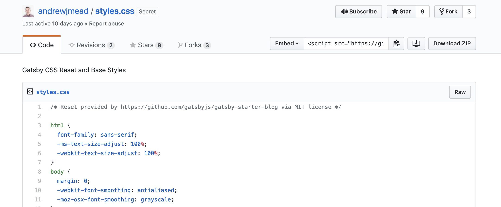

일반적인 방법으로 `class`이름을 주고 스타일을 적용할 경우 이름이 같아 꼬이는 경우가 발생할 수 있다. 그렇기 때문에 CSS Module을 사용하여 적용한다.
방법은 간단하다. `header.scss`였으면 이름에 module을 붙여주면 된다. `header.module.scss`

링크의 색을 바꿔주는 예시로 한 번 변하는지 보려 한다. 만들어진 `header.module.scss`에 다음과 같이 스타일을 작성하고 저장한다.

```css
.link {
  color: #999;
}
```

`Header`부분에 첫 번째 링크에 스타일 적용을 위해 다음과 같이 수정한다.

```javascript
import React from "react"
import { Link } from "gatsby"

import headerStyles from "./header.module.scss"

const Header = () => {
  return (
    <header>
      <h1>JSnow</h1>
      <nav>
        <ul>
          <li>
            <Link className={headerStyles.link} to="/">
              Home
            </Link>
          </li>
...
```

CSS Module이 적용된 `Link`의 클래스 이름을 보면 다음과 같이 식별자가 따로 붙어 있다. 이렇게 생성된 유니크한 클래스 이름을 통해 다른 컴포넌트에서 사용하는 클래스 이름과 중복되는 것을 방지할 수 있다.


이제 레이아웃에 대한 스타일을 만들어 주기 위해 동일한 폴더에 `layout.module.scss`를 만들어주고 동일하게 import한다.

```scss
.container {
  margin: 0 auto;
  max-width: 750px;
  padding: 1rem;
}
```

```javascript
import React from "react"

import Header from "../components/header"
import Footer from "../components/footer"
import "../styles/index.scss"
import layoutStyles from "./layout.module.scss"

const Layout = props => {
  return (
    <div className={layoutStyles.container}>
      <Header />
      {props.children}
      <Footer />
    </div>
  )
}

export default Layout

```

Sticky Footer를 적용하기 위해 `<div>`하나를 생성하고 그 안에 Footer를 제외한 나머지를 넣어준다.

```javascript
import React from "react"

import Header from "../components/header"
import Footer from "../components/footer"
import "../styles/index.scss"
import layoutStyles from "./layout.module.scss"

const Layout = props => {
  return (
    <div className={layoutStyles.container}>
      <div>
        <Header />
        {props.children}
      </div>
      <Footer />
    </div>
  )
}

export default Layout
```

`.content`와 `.container`에 관한 스타일을 추가한 뒤 `.content`를 JSX에 추가한다.

```css
.container {
  margin: 0 auto;
  max-width: 750px;
  padding: 1rem;

  display: flex;
  flex-direction: column;
  min-height: 100vh;
}

.content {
  flex-grow: 1;
}
```

```javascript
const Layout = props => {
  return (
    <div className={layoutStyles.container}>
      <div className={layoutStyles.content}>
        <Header />
        {props.children}
      </div>
      <Footer />
    </div>
  )
}
```

몇가지 레이아웃 및 헤더에 관한 스타일을 적용한다.
```css
.header {
  padding: 1rem 0 3rem;
}

.title {
  color: #000000;
  font-size: 3rem;
  text-decoration: none;
}

.nav-list {
  display: flex;
  list-style-type: none;
  margin: 0;
}

.nav-item {
  color: #999;
  font-size: 0.9rem;
  margin-right: 1.3rem;
  text-decoration: none;
}

.nav-item:hover {
  color: #666666;
}

.active-nav-item {
  color: #333333;
}
```

```javascript
import React from "react"
import { Link } from "gatsby"

import headerStyles from "./header.module.scss"

const Header = () => {
  return (
    <header className={headerStyles.header}>
      <h1>
        <Link className={headerStyles.title} to="/">
          JSnow Blog
        </Link>
      </h1>
      <nav>
        <ul className={headerStyles.navList}>
          <li>
            <Link
              className={headerStyles.navItem}
              activeClassName={headerStyles.activeNavItem}
              to="/"
            >
              Home
            </Link>
          </li>
          <li>
            <Link
              className={headerStyles.navItem}
              activeClassName={headerStyles.activeNavItem}
              to="/blog"
            >
              Blog
            </Link>
          </li>
          <li>
            <Link
              className={headerStyles.navItem}
              activeClassName={headerStyles.activeNavItem}
              to="/about"
            >
              About
            </Link>
          </li>
          <li>
            <Link
              className={headerStyles.navItem}
              activeClassName={headerStyles.activeNavItem}
              to="/contact"
            >
              Contact
            </Link>
          </li>
        </ul>
      </nav>
    </header>
  )
}

export default Header
```

이제 드디어 데이터를 다뤄보려고 한다. Gatsby는 Graphql을 이용한다. gatsby에서는 graphql의 깊은 부분까지 다루지 않기 때문에 걱정하지 않아도 된다.

Gatsby는 아래의 그림과 같은 원리로 작동한다.


앞으로 우리는 `gatby-config`파일을 수정하여 데이터를 전달하게 만드려고 한다.

먼저 graphql로 어떻게 데이터를 주고 받는지 확인하기 위해 다음과 같이 페이지 제목과 작성자를 데이터에 넣는다.
```javascript
module.exports = {
  siteMetadata: {
    title: "JSnow's dev blog",
    author: "Snow Jang",
  },
  // in gatsby-config.js
  plugins: [`gatsby-plugin-sass`],
}
```

graphql에서 데이터를 확인하려면 [GraphiQL](http://localhost:8000/__graphql)을 이용한다.

여기서 왼쪽을 보면 쿼리를 넣을 수 있는데 왼편에 쿼리를 넣고 재생 버튼을 누르면 왼쪽에 결과를 볼 수 있다.

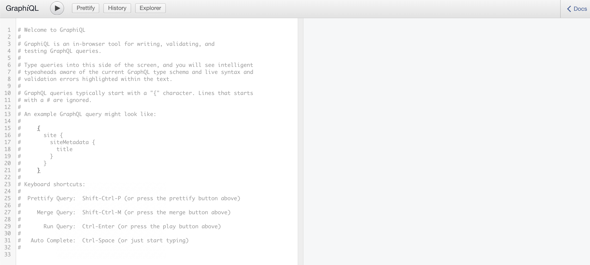

오른쪽 패널 끝의 Docs를 누르면 다음과 같이 볼 수 있는데 


Graphql에는 **query**, **mutation**, **subscribtion** 3가지 주요한 operation이 있다. 우리는 그 중에 query를 주로 이용할 예정이다. 

`Query` > `Site` > `siteMetadata` 의 경로로 타고 들어가면 우리가 넣은 `title`과 `author` 데이터로 접근할 수 있다.


접근 경로를 알았으니 실제로 접근해서 동일한 결과가 나오는지 확인하면 다음과 같다.

```javascript
query {
  site {
    siteMetadata {
      title
    }
  }
}
```


이제 이를 활용하여 웹 페이지의 Title을 반영하려면 다음과 같이 작성하면 된다.

```javascript
import React from "react"
import { Link, graphql, useStaticQuery } from "gatsby"

import headerStyles from "./header.module.scss"

const Header = () => {
  const data = useStaticQuery(graphql`
    query {
      site {
        siteMetadata {
          title
        }
      }
    }
  `)

  return (
    <header className={headerStyles.header}>
      <h1>
        <Link className={headerStyles.title} to="/">
          {data.site.siteMetadata.title}
        </Link>
      </h1>
```
graphql을 제대로 이용하기 위해서는 `graphql`과 `useStaticQuery` 모듈을 import 해서 쓴다.
그리고 `data` 변수에 useStaticQuery()메서드와 graphql메서드를 이용하는데 이용 방식이 좀 특이하다 앞에서 썼던 쿼리를 template string의 형식인 Backtick 사이에 넣어서 이용한다. 결과가 올바르게 반영 되었다.


동일한 방법으로 한 번 `Footer`에 author이름을 적용해보면 다음과 같다.

```javascript
import React from "react"
import { graphql, useStaticQuery } from "gatsby"

const Footer = () => {
  const data = useStaticQuery(graphql`
    query {
      site {
        siteMetadata {
          author
        }
      }
    }
  `)
  return (
    <footer>
      <p>Created by {data.site.siteMetadata.author}, © 2019</p>
    </footer>
  )
}

export default Footer
```

참고로 두 개를 가져오고 싶으면 다음과 같이 작성하면 둘 다 가져올 수 있다.


이렇게 graphiql도 유용하지만 좀 더 유용한 도구를 사용해보려 한다. [graphql playground](https://github.com/prisma/graphql-playground)는 GraphiQL의 구성 요소를 사용하지만, 더 나은 (로컬) 개발 워크 플로우를 가능하게 한다. GraphQL을 위한 IDE다. 더 많은 기능을 담고 있다.

먼저 이를 위해서 루트 폴더에 `.env.development`라는 환경 파일을 만든다. 그리고 다음과 같이 작성하면 된다.

```
GATSBY_GRAPHQL_IDE=playground
```

그리고 가동중이던 서버를 끄고 필요한 라이브러리를 하나 받아준다.

```bash
npm install --save-dev env-cmd
```

그리고 이를 이용하기 위해 `package.json`에 `develop` 부분을 다음과 같이 수정한다.

```json
{
  "name": "gatsby-starter-hello-world",
  "private": true,
  "description": "A simplified bare-bones starter for Gatsby",
  "version": "0.1.0",
  "license": "MIT",
  "scripts": {
    "build": "gatsby build",
    "develop": "env-cmd .env.development gatsby develop",
    "format": "prettier --write src/**/*.{js,jsx}",
    "start": "npm run develop",
    "serve": "gatsby serve",
    "test": "echo \"Write tests! -> https://gatsby.dev/unit-testing\""
  },
  "dependencies": {
```

이제 세팅을 다 끝내고 `npm run develop`으로 서버를 키면 다음과 같은 에러를 만나게 된다.
```bash
> npm run develop

> gatsby-starter-hello-world@0.1.0 develop /Users/soonho/project/gatsby-practice
> env-cmd .env.development gatsby develop

Error: Unable to locate env file at default location (./.env)
    at /Users/soonho/project/gatsby-practice/node_modules/env-cmd/dist/get-env-vars.js:44:19
    at Generator.throw (<anonymous>)
    at rejected (/Users/soonho/project/gatsby-practice/node_modules/env-cmd/dist/get-env-vars.js:5:65)
    at processTicksAndRejections (internal/process/task_queues.js:89:5)
npm ERR! code ELIFECYCLE
npm ERR! errno 1
npm ERR! gatsby-starter-hello-world@0.1.0 develop: `env-cmd .env.development gatsby develop`
npm ERR! Exit status 1
npm ERR! 
npm ERR! Failed at the gatsby-starter-hello-world@0.1.0 develop script.
npm ERR! This is probably not a problem with npm. There is likely additional logging output above.

npm ERR! A complete log of this run can be found in:
npm ERR!     /Users/soonho/.npm/_logs/2019-06-19T13_22_21_553Z-debug.log
```

[Using the GraphQL Playground](https://www.gatsbyjs.org/docs/using-graphql-playground/)를 참고하면 좋을 것 같다. 

다음과 같이 `-f`를 가운데에 추가하여 저장하고 다시 `npm run develop`를 실행한다.

```json
"develop": "env-cmd -f .env.development gatsby develop"
```

[http://localhost:8000/___graphql](http://localhost:8000/___graphql)로 접속하면 아까와는 다른 화면이 나온다. 바로 GraphQL playground다. 아까의 GraphiQL과 동일하게 작동하며 기능이 좀 더 많다.

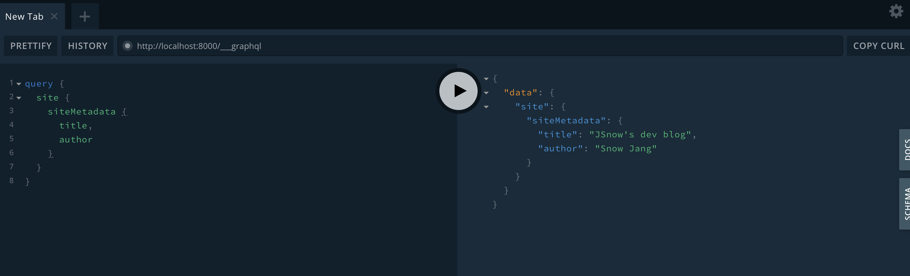

탭 기능도 있어서 여러개 만들 수 있고 DOCS기능도 expand형식으로 되어있어 더 보기 쉽다.


이제 본격적으로 포스트를 가져올 수 있는 기능을 넣어보려 한다.
이를 위해 루트 폴더에 `./src/posts` 폴더를 생성하고 안에 `gatsby.md`와 `react.md`를 만든다.

```markdown
---
title: "Gatsby를 사용하는 방법"
date: "2019-04-04"
---

Gatsby를 이용하여 블로그를 만들기 위해서는 다음과 같은 사전지식이 필요하다.

## 블로그를 만들기 위해 알아야 할 것들

1. Gatsby & Netlify
2. React
3. GraphQL
```

```markdown
---
title: "React를 처음 접했을 때"
date: "2019-04-02"
---

React는 정말 좋은 Framework다!
```

이제 재료는 준비되었으니 도구가 필요하다. 이전과 동일하게 [플러그인 검색 페이지](https://www.gatsbyjs.org/packages/gatsby-source-filesystem/?=source)에서 **source**를 검색한다. Gatsby에는 source를 다루는 다양한 플러그인이 존재한다. 그 중 우리는 **gatsby-source-filesystem**을 이용하려 한다.


npm을 통해 설치하고 `gatsby-config.js` 파일의 `plugins`부분에 추가로 옵션을 넣어 준다.

```bash
npm install gatsby-source-filesystem
```

```javascript
plugins: [
    `gatsby-plugin-sass`,
    {
      resolve: "gatsby-source-filesystem",
      options: {
        name: "src",
        path: `${__dirname}/src/`,
      },
    },
  ],
```

이렇게 옵션을 추가하고 서버를 다시 재실행하면 다음과 같이 queries에 추가로 file과 directory관련 query가 추가된 것을 확인할 수 있다.


그러고나서 playground에서 다음과 같이 query를 작성하면 프로젝트 내의 name, extentison, dir에 관한 정보를 받을 수 있다.

```
query{
  allFile{
    edges{
      node{
        name
        extension
        dir
      }
    }
  }
}
```


맨 아래로 내려가면 우리가 생성한 post를 확인할 수 있다.

```
{
  "node": {
    "name": "react",
    "extension": "md",
    "dir": "/Users/soonho/project/gatsby-practice/src/posts"
  }
},
{
  "node": {
    "name": "gatsby",
    "extension": "md",
    "dir": "/Users/soonho/project/gatsby-practice/src/posts"
  }
}
```
마크다운을 변환시켜 주기 위해서 새로운 플러그인을 설치한다. 역시나 마찬가지로 플러그인 검색 페이지에서 **REMARK**를 검색하여 [gatsby-transformer-remark](https://www.gatsbyjs.org/packages/gatsby-transformer-remark/?=remark)를 설치한다.
여기서 remark는 markdown파일을 파싱해주는 javascript library다.

그리고 `gatsby-config.js`의 `plugins`를 다음과 같이 수정한다.

```javascript
plugins: [
    `gatsby-plugin-sass`,
    {
      resolve: "gatsby-source-filesystem",
      options: {
        name: "src",
        path: `${__dirname}/src/`,
      },
    },
    `gatsby-transformer-remark`,
  ],
```

다시 graphql playground에 접속하면 다음과 같이 두개의 새로운 항목이 생긴것을 확인할 수 있다.


* `markdownRemark`는 개별적인 post를 fetch한다. 
* `allMarkdownRemark`는 post목록을 fetch한다.

우리는 `allMarkdownRemark`를 활용하여 블로그 리스트를 만드는 페이지를 완성하려 한다.

`allMarkdownRemark` > `edges` > `node` > `frontmatter`를 타고 들어가서 살펴보면 다음과 같이 `title`과`date`를 볼 수 있다.


이제 실제 graphql로 잡아서 어떤 데이터를 불러 올 수 있는지 보면 다음과 같다.

```javascript

query{
  allMarkdownRemark{
    edges{
      node{
        frontmatter{
          title
          date
        }
      }
    }
  }
}
```

결과를 보면 아까 작성 했던 post들의 titl과 date를 확인할 수 있다.

```javascript
{
  "data": {
    "allMarkdownRemark": {
      "edges": [
        {
          "node": {
            "frontmatter": {
              "title": "Gatsby를 사용하는 방법",
              "date": "2019-04-04"
            }
          }
        },
        {
          "node": {
            "frontmatter": {
              "title": "React를 처음 접했을 때",
              "date": "2019-04-02"
            }
          }
        }
      ]
    }
  }
}
```

frontmatter외에 html과 excerpt를 추가하면 다음과 같은 결과를 얻을 수 있다.

```javascript
query{
  allMarkdownRemark{
    edges{
      node{
        frontmatter{
          title
          date
        }
        html
        excerpt
      }
    }
  }
}
```

```javascript
"data": {
    "allMarkdownRemark": {
      "edges": [
        {
          "node": {
            "frontmatter": {
              "title": "Gatsby를 사용하는 방법",
              "date": "2019-04-04"
            },
            "html": "<p>Gatsby를 이용하여 블로그를 만들기 위해서는 다음과 같은 사전지식이 필요하다.</p>\n<h2>블로그를 만들기 위해 알아야 할 것들</h2>\n<ol>\n<li>Gatsby &#x26; Netlify</li>\n<li>React</li>\n<li>GraphQL</li>\n</ol>",
            "excerpt": "Gatsby를 이용하여 블로그를 만들기 위해서는 다음과 같은 사전지식이 필요하다.블로그를 만들기 위해 알아야 할 것들Gatsby & NetlifyReactGraphQL"
          }
        },
```

이제 이 글의 제목과 시간을 실제 블로그 페이지에 불러오려면 다음과 같이 `blog.js`에 작성하면 된다.

```javascript
import React from "react"
import { graphql, useStaticQuery } from "gatsby"

import Layout from "../components/layout"

const BlogPage = () => {
  const data = useStaticQuery(graphql`
    query {
      allMarkdownRemark {
        edges {
          node {
            frontmatter {
              title
              date
            }
          }
        }
      }
    }
  `)

  console.log(data)
```

다음과 같이 불러올 수 있음을 확인할 수 있다.

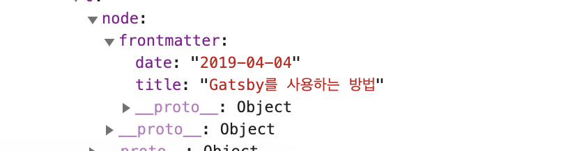

이제 뿌려주는 일만 남았다. 각각의 글 목록은 `<ol>`을 통해 뿌려진다. 이를 위해 `map`을 이용한다.

```javascript
import React from "react"
import { graphql, useStaticQuery } from "gatsby"

import Layout from "../components/layout"

const BlogPage = () => {
  const data = useStaticQuery(graphql`
    query {
      allMarkdownRemark {
        edges {
          node {
            frontmatter {
              title
              date
            }
          }
        }
      }
    }
  `)
  return (
    <Layout>
      <h1>Blog</h1>
      <ol>
        {data.allMarkdownRemark.edges.map(edge => {
          return (
            <li>
              <h2>{edge.node.frontmatter.title}</h2>
              <p>{edge.node.frontmatter.date}</p>
            </li>
          )
        })}
      </ol>
    </Layout>
  )
}

export default BlogPage

```

리스트에 대한 오류는 일단 무시하고 넘어간다.

```bash
Warning: Each child in a list should have a unique "key" prop.
```

---

이제 블로그 post를 선택하면 페이지가 동적으로 자동 생성되게 만들어 주고 싶다. 다시 말해, 데이터를 정형화된 양식에 맞춰 생성하게 만들고 싶다.

root폴더에 `gatsby-node.js`를  생성한다. 

그런 다음 gatsbyì˜ DOCS 페이지에서 API REFERENCEì˜ [Gatsby Node APIs](https://www.gatsbyjs.org/docs/node-apis/) 에서 필요한 api를 찾아본다. 

`onCreateNode` 를 사용할 것이다. 여기서 node는 query에서 보았던 node다. 각 post를 뜻한다고 보면 쉽다.


아까 생성한 `gatsby-node.js`에 다음과 같이 작성한다. 일단, `createNode`는 아직 사용하지 않는다. 먼저 확인을 위해 콘솔로 한 번 찍어본다. 이를 위해 서버를 다시 시작한다. 

```javascript
module.exports.onCreateNode = ({ node, actions }) => {
  const { createNodeField } = actions
  console.log(JSON.stringfy(node, undefined, 4))
}
```

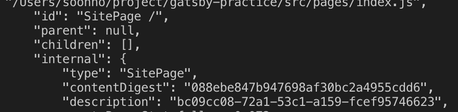

여기서 우리는 `internal` > `type` 에 집중하며 다시 다음과 같이 고친 이후 출력한다.

```javascript
module.exports.onCreateNode = ({ node, actions }) => {
  const { createNodeField } = actions
  if (node.internal.type === "MarkdownRemark") {
    console.log(JSON.stringify(node, undefined, 4))
  }
}
```

다음과 같이 나온다. 여기서 중요한 것은 현재 나와있는 `fileAbsolutePath`를 변경할 것이라는 점이다.

```javascript
{
    "id": "809ad49b-0045-5668-a92a-556b2295bc3c",
    "children": [],
    "parent": "7b04ea0b-802c-504b-bfa7-fa3593bdf53c",
    "internal": {
        "content": "\nReact는 정말 좋은 Framework다!",
        "type": "MarkdownRemark",
        "contentDigest": "1bb5ac23b81d05f31949bb2d2594f198",
        "owner": "gatsby-transformer-remark"
    },
    "frontmatter": {
        "title": "React를 처음 접했을 때",
        "date": "2019-04-02"
    },
    "excerpt": "",
    "rawMarkdownBody": "\nReact는 정말 좋은 Framework다!",
    "fileAbsolutePath":
"/Users/soonho/project/gatsby-practice/src/posts/react.md"
```

그렇게 하기 위해서는 node에서 [path와 관련된 모듈](https://nodejs.org/dist/latest-v10.x/docs/api/path.html)을 가져와 사용한다. `basename` 을 사용한다.

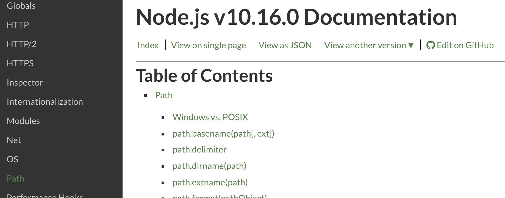

다음과 같이 작성하고 확인하면 우리가 만든 포스트의 확장자를 제외한 이름이 출력된다.

```javascript
const path = require("path")

module.exports.onCreateNode = ({ node, actions }) => {
  const { createNodeField } = actions
  if (node.internal.type === "MarkdownRemark") {
    const slug = path.basename(node.fileAbsolutePath, ".md")
    console.log("@@@@@@@@@@@", slug)
  }
}
```


이제 이름을 분리하였고 이를 query에 넣어준다. 이를 위해서는 다음과 같이 작성한다.

```javascript
const path = require("path")

module.exports.onCreateNode = ({ node, actions }) => {
  const { createNodeField } = actions
  if (node.internal.type === "MarkdownRemark") {
    const slug = path.basename(node.fileAbsolutePath, ".md")
    createNodeField({
      node,
      name: "slug",
      value: slug,
    })
  }
}
```

graphql playground를 들어가서 한 번 결과를 출력하면 다음과 같다.

```javascript
query{
  allMarkdownRemark{
    edges{
      node{
        frontmatter{
          title
          date
        }
        html
        excerpt
        fields{
          slug
        }
      }
    }
  }
}
```

```javascript
{
  "data": {
    "allMarkdownRemark": {
      "edges": [
        {
          "node": {
            "frontmatter": {
              "title": "React를 처음 접했을 때",
              "date": "2019-04-02"
            },
            "html": "<p>React는 정말 좋은 Framework다!</p>",
            "excerpt": "React는 정말 좋은 Framework다!",
            "fields": {
              "slug": "react"
            }
          }
        },

```

---

이제, 블로그 포스트의 템플릿을 한 번 만들어 보려한다.

우선 `src/templates` 폴더를 만들고 `blog.js`를 생성한다.

```javascript
import React from "react"

import Layout from "../components/layout"

const Blog = () => {
  return <Layout>This is post that i created!</Layout>
}

export default Blog
```

[createPages](https://www.gatsbyjs.org/docs/node-apis/#createPages)라는 페이지를 생성하는 gasby api가 있다. 이를 이용하기 위해서는 `gastby-node.js` 에 다음과 같이 코드를 추가한다.

```javascript
exports.createPages = ({ graphql, actions }) => {
  const { createPage } = actions
  const blogTemplate = path.resolve("./src/templates/blog.js")
}
```

이제 우리는 필요한 데이터를 가져오는데 우리에게 필요한 정보는 `slug` 뿐이기 때문에, query를 추가하여 가져온다. 이때 `graphql`은 앞에서 우리가 쓰던 `graphql` 모듈과 달리 그 자체가 메서드 이기 때문에 메서드의 방식으로 query를 추가하여 사용한다.

```javascript
exports.createPages = ({ graphql, actions }) => {
  const { createPage } = actions
  const blogTemplate = path.resolve("./src/templates/blog.js")
  graphql(`
    query {
      allMarkdownRemark {
        edges {
          node {
            fields {
              slug
            }
          }
        }
      }
    }
  `)
}
```

여기서 `graphql`메서드는 `return` 값으로 `Promise`객체를 반환한다. `async`와 `await`를 통해 비동기 처리를 해줘야한다. createPage를 통해 각각 필요한 인자를 넘겨준다.

```javascript
exports.createPages = async ({ graphql, actions }) => {
  const { createPage } = actions
  const blogTemplate = path.resolve("./src/templates/blog.js")
  const res = await graphql(`
    query {
      allMarkdownRemark {
        edges {
          node {
            fields {
              slug
            }
          }
        }
      }
    }
  `)

  res.data.allMarkdownRemark.edges.forEach(edge => {
    createPage({
      component: blogTemplate,
      path: `/blog/${edge.node.fields.slug}`,
      context: {
        slug: edge.node.fields.slug,
      },
    })
  })
}
```

다시 서버를 껐다 키면 생성된 페이지에 접근할 수 있는데, 아직은 링크를 이어주지 않았기 때문에, 직접 페이지를 접근해야한다. slug에 따라 `localhost:8000/blog/react`와 `localhost:8000/blog/gatsby` 접속해보면 올바르게 접근할 수 있음을 확인할 수 있다.

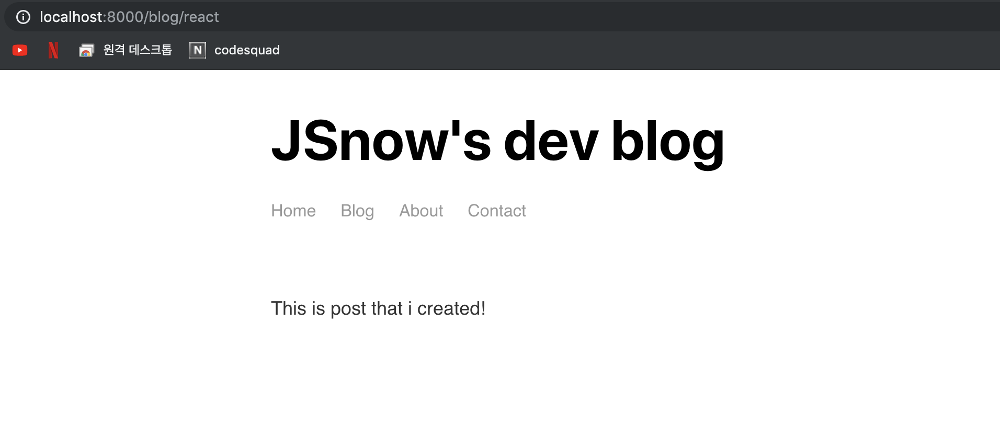

만약에 없는 페이지에 접근해보면 만들어진 생성된 페이지를 확인할 수 있다.


이제 접근 링크를 이어준다. `./src/pages/blog.js` 에서 `gatsby`의 `Link` 모듈을 가져온다

```javascript
import React from "react"
import { Link, graphql, useStaticQuery } from "gatsby"

```

그리고 페이지를 이어주기 위해 필요한 데이터인 `slug`를 쿼리에 추가한다.

```javascript
const data = useStaticQuery(graphql`
    query {
      allMarkdownRemark {
        edges {
          node {
            frontmatter {
              title
              date
            }
            fields {
              slug
            }
          }
        }
      }
    }
  `)
```

그런 다음 `Link`모듈을 이용하여 링크를 생성한다. 아까 생성한 페이지를 링크를 클릭하여 접근할 수 있게 되었다.

```javascript
 return (
    <Layout>
      <h1>Blog</h1>
      <ol>
        {data.allMarkdownRemark.edges.map(edge => {
          return (
            <li>
              <Link to={`/blog/${edge.node.fields.slug}`}>
                <h2>{edge.node.frontmatter.title}</h2>
                <p>{edge.node.frontmatter.date}</p>
              </Link>
            </li>
          )
        })}
      </ol>
    </Layout>
  )
```

---

이제 페이지를 클릭하면 각각에 맞는 데이터를 가져올 수 있게끔 만드려고 한다. 

다시 playground로 가서 우리가 필요한 데이터를 한 번 확인해보면 다음과 같다. `slug`에  `eq`를 지정하여 가져오려고 한다. (조건부 탐색처럼)

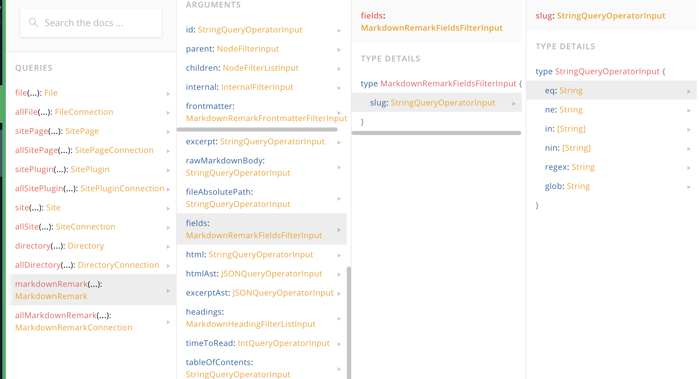

우리가 앞에서 데이터를 가져올 때 다음과 같이 가져왔었다.

```javascript
query{
  markdownRemark{
    frontmatter{
      title
    }
  }
}
```

여기에 조건을 주기 위해 graphql에서는 인자를 넣어 조건을 기준으로 탐색하게 할 수 있다.

`markdownRemark`에 인자를 넣어 조건에 맞는 데이터를 가져오면 다음과 같다.

```javascript
query{
  markdownRemark (
    fields:{
      slug:{
        eq: "react"
      }
    }
  ){
    frontmatter{
      title
    }
  }
}
```

```javascript
{
  "data": {
    "markdownRemark": {
      "frontmatter": {
        "title": "React를 처음 접했을 때"
      }
    }
  }
}
```

하지만 이걸 실제로 쓰기위해서는 **query variables** 를 이용하여 동적으로 값을 줄 수 있게 만들어야 한다. 화면 아래의 QUERY VARIABLES를 클릭하면 콘솔창 하나가 나오는데 여기에 값을 넣어 주고 query 자체에 인자를 받을 수 있게 바꿔준다. 아까와 같이 react에 대한 결과가 출력된다. 만약 여기서 `"slug":"react"`를 `"gatsby"`로 변경하면 이에 맞는 결과가 출력된다.

```javascript
query(
  $slug: String!
){
  markdownRemark (
    fields:{
      slug:{
        eq: $slug
      }
    }
  ){
    frontmatter{
      title
    }
  }
}
```

```javascript
{
  "slug" : "react"
}
```


이제 이 query를 직접 사용해보자. 여기서 앞에서와 같이 `useStaticQuery`를 이용한 방법으로는 쿼리를 불러올 수 없다. 동적으로 데이터를 할당할 경우, 아래와 같이 사용해야 한다. query를 export하고, 이를 불러와서 사용해야 한다.

```javascript
import React from "react"
import { graphql } from "gatsby"

import Layout from "../components/layout"

export const query = graphql`
  query($slug: String!) {
    markdownRemark(fields: { slug: { eq: $slug } }) {
      frontmatter {
        title
        date
      }
      html
    }
  }
`

const Blog = props => {
  return (
    <Layout>
      <h1>{props.data.markdownRemark.frontmatter.title}</h1>
      <p>{props.data.markdownRemark.frontmatter.date}</p>
    </Layout>
  )
}

export default Blog

```

이제 여기에 내용에 해당하는 부분을 불러오는데, 이때는 react의 `dangerouslySetInnerHTML`를 이용한다.


```javascript
const Blog = props => {
  return (
    <Layout>
      <h1>{props.data.markdownRemark.frontmatter.title}</h1>
      <p>{props.data.markdownRemark.frontmatter.date}</p>
      <div
        dangerouslySetInnerHTML={{ __html: props.data.markdownRemark.html }}
      ></div>
    </Layout>
  )
}
```

올바르게 데이터를 가져와서 뿌려주고 있다.


---

## Post에 이미지 더하기

3가지 플러그인을 설치하여 쉽게 처리할 수 있다.

아무 이미지나 `src/posts`에 넣는다. 그리고 `gatsby.md`에 다음과 같이 Markdown에 맞는 이미지 경로를 설정하여 하나 만든다.

```markdown

```

이제 다시 서버를 끄고 플러그인들을 설치한다

```bash
npm install gatsby-plugin-sharp gatsby-remark-images gatsby-remark-relative-images
```

그리고 `gastby-config.js`를 다음과 같이 수정한다.

```javascript
module.exports = {
  siteMetadata: {
    title: "JSnow's dev blog",
    author: "Snow Jang",
  },
  // in gatsby-config.js
  plugins: [
    "gatsby-plugin-sass",
    {
      resolve: "gatsby-source-filesystem",
      options: {
        name: "src",
        path: `${__dirname}/src/`,
      },
    },
    "gatsby-plugin-sharp",
    {
      resolve: "gatsby-transformer-remark",
      options: {
        plugins: [
          "gastby-remark-relative-images",
          {
            resolve: "gastby-remark-images",
            opsions: {
              maxWidth: 750,
              linkImagesToOriginal: false,
            },
          },
        ],
      },
    },
  ],
}
```

다시 실행하면 이미지가 잘 들어가는 것을 확인할 수 있다.


필요하다면, `src/posts/gatsby`를 생성하여 `gatsby.md`와 `gatsby-image.jpg` 를 옮겨서 이미지와  마크다운문서를 함께 관리할 수 있다.

추가로 `footer`가 너무 붙어 있고 스타일이 없어 마치 글의 연장선으로 보인다. 이를 위해, `footer`에 스타일을 추가한다. `footer.module.scss` 를 만들고 다음과 같은 스타일을 추가한다.

```css
.footer {
  margin-top: 3rem;
}
```

`footer` 에 이를 이어준다.

```javascript
import footerStyles from "./footer.module.scss"
...
  return (
    <footer className={footerStyles.footer}>
      <p>Created by {data.site.siteMetadata.author}, © 2019</p>
    </footer>
  )
```

그리고 블로그 글 목록을 좀 더 꾸며보자

`src/pages`에 `blog.module.scss`를 생성한다.

```css
.posts {
  list-style-type: none;
  margin: 0;
}
```

```javascript
import blogStyles from "./blog.module.scss"
...
 return (
    <Layout>
      <h1>Blog</h1>
      <ol className={blogStyles.posts}>
```

이제 `<li>`와 `<h2>`, `<p>`에 스타일을 주려 하는데, 이렇게 하나하나 적용하는 방식은 번거롭다.

한꺼번에 적용하고 싶다. 먼저 `<li>`에 우리가 했던 방식대로 스타일을 적용하면 다음과 같다.

```css
.post {
  margin: 1rem 0;
}
```

```javascript
return (
  <li className={blogStyles.post}>
    <Link to={`/blog/${edge.node.fields.slug}`}>
      <h2>{edge.node.frontmatter.title}</h2>
      <p>{edge.node.frontmatter.date}</p>
    </Link>
  </li>
)
```

scss를 활용하는 방법이다.

```scss
.post {
  margin: 1rem 0;
  a {
    background: #f4f4f4;
    color: #000;
    display: block;
    padding: 1rem;
    text-decoration: none;
  }
  a:hover {
    background: #e4e4e4;
  }
  h2 {
    margin-bottom: 0;
  }
  p {
    color: #777777;
    font-size: 0.8rem;
    font-style: italic;
  }
}
```
---

## 날짜 포맷 변환

날짜 포맷 변환은 어렵지 않다. `src/pages/blog.js`에서 앞서 사용했던 쿼리를 조금 수정하면 된다.

우선 playground에서 확인하자 원래의 쿼리대로 타고가다 보면 `date`를 만나는데 이 `date` 안에는 `formatString` 이라는 매개변수에 값을 할당하여 날짜 형식을 변경할 수 있다.

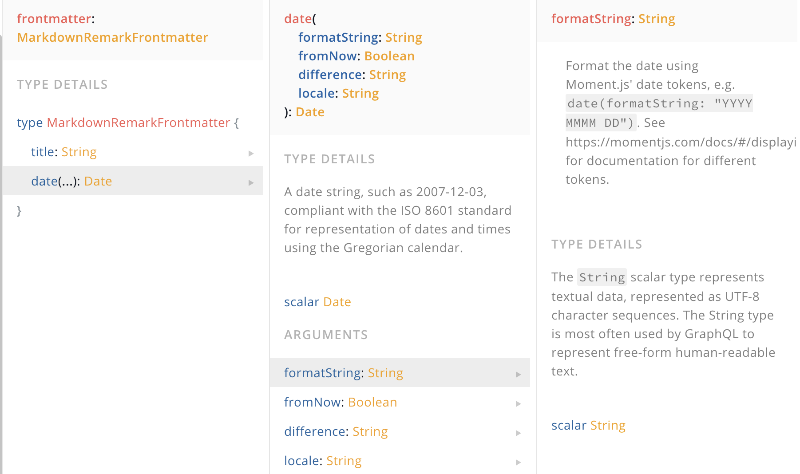

다양한 날짜 형식이 있는데 [momentjs](https://momentjs.com/)를 참고하여 원하는 날짜 형식을 선택하면 된다.

```javascript
query {
      allMarkdownRemark {
        edges {
          node {
            frontmatter {
              title
              date(formatString: "MMMM Do, YYYY")
            }
            fields {
              slug
            }
          }
        }
      }
    }
```

추가로 sort기능도 추가 가능하다. 글의 경우 최신 글이 맨 위로 있기 때문에 그에 맞게 변경해야한다.


`frontmatter`내부에 있는 `date`를 기준으로 하기 때문에 다음과 같이 작성하여 이용한다.

```javascript
query {
      allMarkdownRemark (
        sort:{
          fields: frontmatter___date
          order:DESC
        }
      ){
        edges {
          node {
            frontmatter {
              title
              date(formatString: "MMMM Do, YYYY")
            }
            fields {
              slug
            }
          }
        }
      }
    }
```

---

## 404 Page와 React Helmet

`src/pages`에 `404.js`를 생성한다.

```javascript
import React from "react"
import { Link } from "gatsby"

import Layout from "../components/layout"

const NotFound = () => {
  return (
    <Layout>
      <h1>Page not found</h1>
      <p>
        <Link to="/">Head home</Link>
      </p>
    </Layout>
  )
}

export default NotFound
```

서버를 다시 실행하고 아무 틀린 주소를 입력하면 다음과 같이 나오는데, 이 페이지는 실제 프로덕트 페이지에서는 보이지 않는다. 직접 만든 404 page는 `Preview custom 404 page`를 클릭하여 확인가능하다. 


이제 [React Helmet](https://github.com/nfl/react-helmet)을 사용해보려 한다. 이와 같이 [gatsby-plugin-react-helmet](https://www.gatsbyjs.org/packages/gatsby-plugin-react-helmet/)을 이용하면 쉽게 쓸 수 있다.

```bash
npm install gatsby-plugin-react-helmet react-helmet
```

`gatsby-config.js` 도 수정한다.

```javascript
// in gatsby-config.js
  plugins: [
    "gatsby-plugin-react-helmet",
```

모든 파일에 head를 만들어 줄 수도 있지만 그것보다는 페이지마다 동적으로 할당하는 것이 더 좋다. 따라서 `src/components`에 `head.js`를 생성한다. 테스트를 위해 간단하게 작성하였다.

```javascript
import React from "react"
import { Helmet } from "react-helmet"

const Head = () => {
  return <Helmet title="This is a test" />
}
export default Head
```

테스트를 위해 `src/pages/index.js`를 수정한다. 

```javascript
import React from "react"

import Layout from "../components/layout"
import Head from "../components/head"

const IndexPage = () => {
  return (
    <div>
      <Layout>
        <Head />
        <h1>Hello.</h1>
        <h2>I'm JSnow! Front-end developer, I'm learning React!</h2>
      </Layout>
    </div>
  )
}

export default IndexPage
```

올바르게 This is a test를 출력하고 있다. 여기서 favicon을 바꿔주고 싶다면, 루트 폴더의 `static/favicon.ico`를 수정하면 된다.

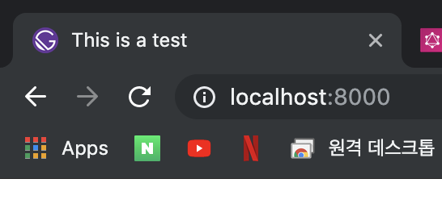

---

## 

## Gatsby로 만든 페이지 배포하기

`.env.development`는 키값같은 다양한 데이터를 담고 있다. 여기서는 CONTENTFUL이란 라이브러리의 키값을 가지고 있지만 실제 연습에서는 사용하지 않았다.


이 `.env.development`의 이름을 `.env`로 바꾼다. 그리고 `package.js` 에서 `scripts`부분도 수정한다.

```javascript
"scripts": {
    "build": "gatsby build",
    "develop": "env-cmd -f .env gatsby develop",
    "format": "prettier --write src/**/*.{js,jsx}",
```

그리고 필요한 git repository를 만들어주고 모든 파일을 업로드 한다.


배포를 위해서는 [Netlify](https://www.netlify.com/)를 이용한다. 완전 무료다.


`New site from git`을 누른다.

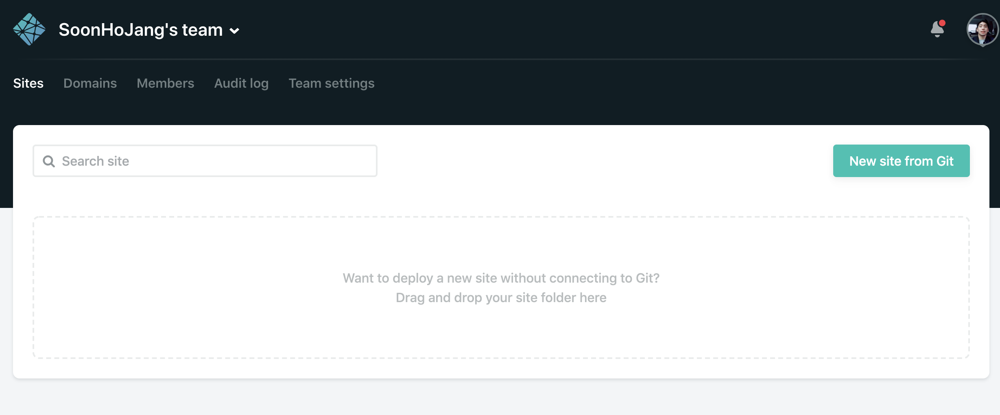

원하는 git provider를 선택한다.

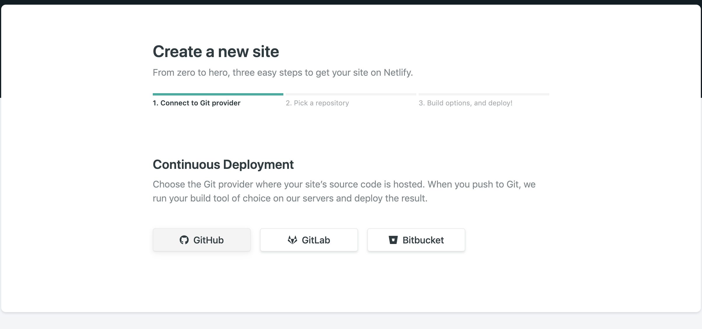

모든 레포를 가져올지 딱 하나의 레포를 가져올지 정할 수 있다. 아까 만들었던 레포를 가져와 배포할 예정이기 때문에 Only select repositories에서 필요한 레포를 선택한다.

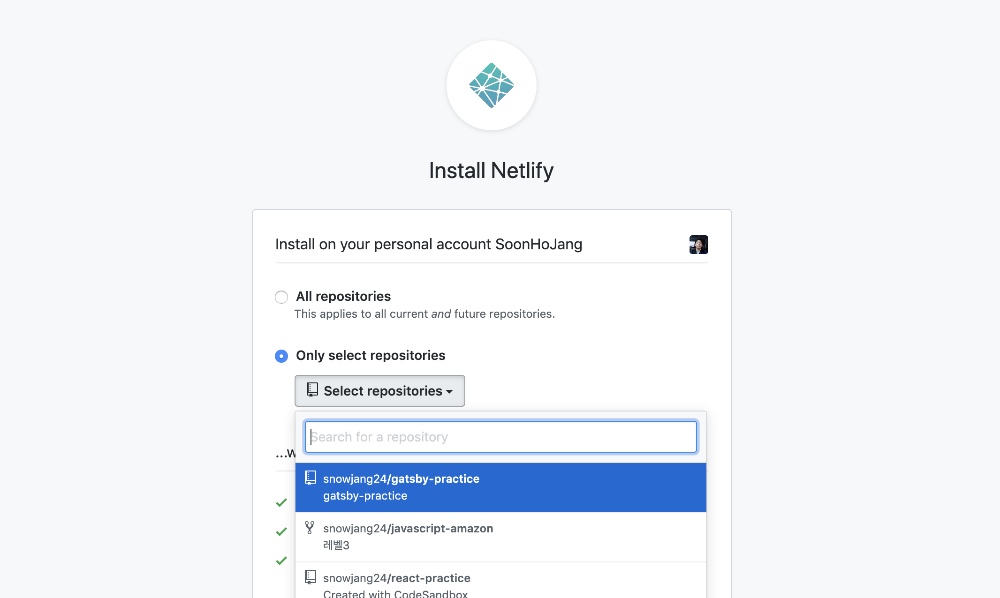

그리고 Install 하면 된다.


선택한 레포를 다시 클릭하면 세팅페이지로 넘어간다.


그런다음 원하는 브랜치를 선택하여 배포할 수 있다. 필요하면 master말고 다른 브랜치를 두어 그 브랜치를 배포해도 된다. 다른 아래의 Basic build settings는 굳이 건드릴 필요가 없다.

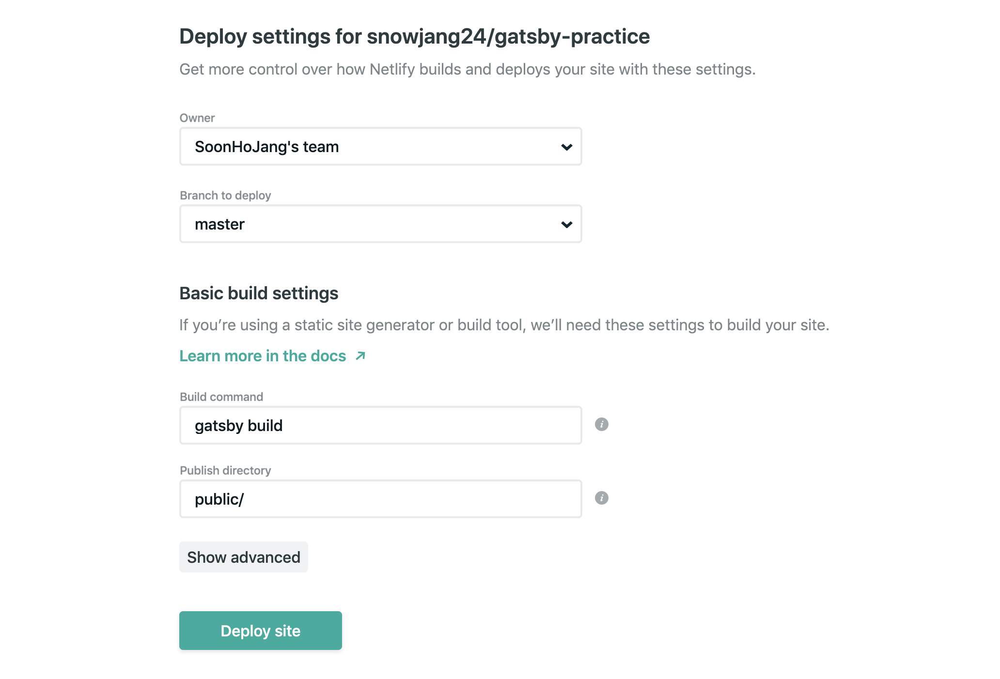

아래에 보면 Show advanced 버튼이 있는데 눌러서 아래와 같이 Advanced build settings를 할 수 있다. 여기서 New variable을 누르면 아래와 같이 Key value를 입력할 수 있는 칸이 나오는데 아까 .env파일과 동일하게 역할한다. 만약 필요한 access key가 있다면 이를 활용하여 값을 넘겨줄 수 있다.

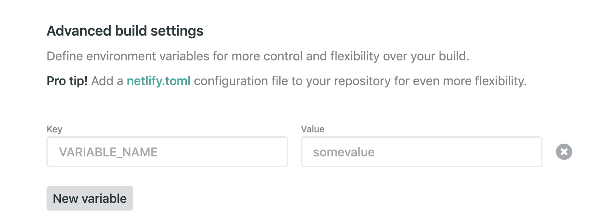

이제 디플로이중인 화면이 나오는데 시간이 조금 걸린다.

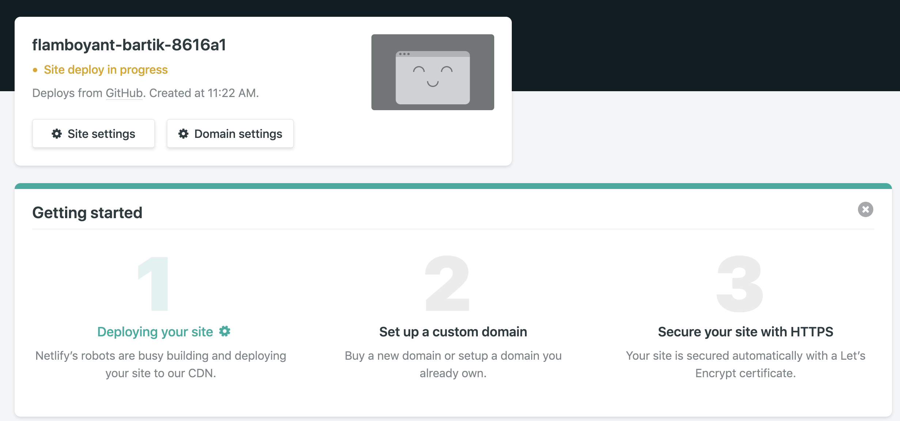

디플로이가 완료되면 페이지 주소가 나오는데 눌러서 접속하면 블로그가 디플로이 된 것을 확인할 수 있다.


만약 데이터를 수정하고 데이터를 사이트에 반영하고 싶다면 아래와 같이 Deploys탭에 가서 Trigger deploy를 눌러  Clear cache and deploy site를 눌러 디플로이 할 수 있다.

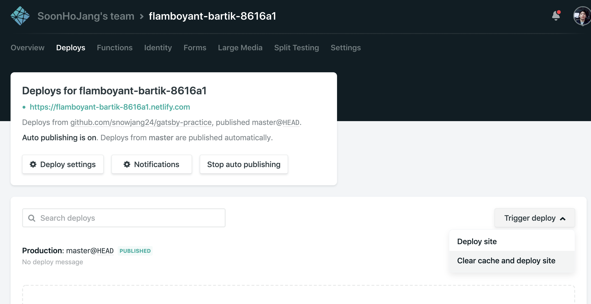

이보다는 우리가 잘 쓰는 로컬에서는 git에 수정사항을 다시 push 하면 자동으로 다시 Publish 된다.