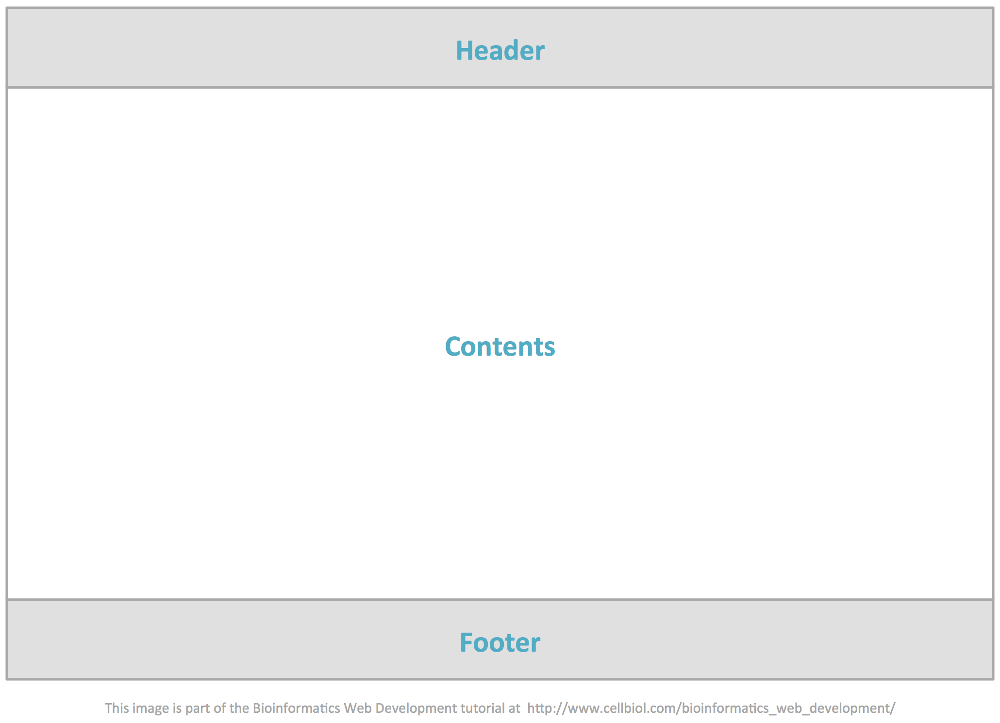
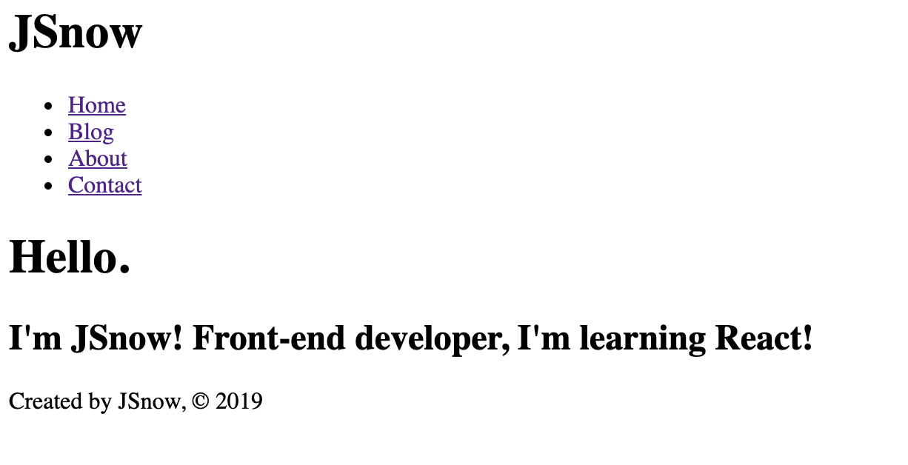

[목록으로](https://github.com/snowjang24/gatsby-practice)

# Gatsby와 React로 만드는 블로그

## ✏️Header, Footer

### 링크 태그? 링크 컴포넌트!

Gatsby에서 링크는 우리가 아는 앵커 태그(`<a>`)를 이용하는 것 보다 `gatsby`모듈에 있는 `Link` 컴포넌트를 사용하는 것이 좋다. `Link`컴포넌트를 사용하면 화면 전환시 반짝거리는 로드가 없어지는 등의 최적화가 자동으로 이루어진다.
아래의 두 태그를 직접 눌러보면 `Link`컴포넌트가 더 빠른 것을 알 수 있다. 더 자세한 정보는 Gatsby의 [linking between pages](https://www.gatsbyjs.org/docs/recipes/#linking-between-pages)를 참고하면 된다.

```javascript
import React from "react"
import { Link } from "gatsby"

const AboutPage = () => {
  return (
    <div>
      <h1>About me</h1>
      <p>I'm just student who loves front-end and design</p>
      <p>
        Need a developer? <a href="/contact">Contact me.</a>
      </p>
      <p>
        Need a developer? <Link to="/contact">Contact me.</Link>
      </p>
    </div>
  )
}

export default AboutPage
```

추가로, Link모듈은 현재 웹 주소를 기준으로 주소를 완성하여 완성된 주소로. 예를 들어, 내 블로그 주소가 `https://myblog.com/`이라면 `<Link to="/blog">` 라고 적었을 때 `https://myblog.com/blog`로 이동한다.

<br>

### Header 그리고 Footer

앞에서 기본적인 틀은 만들었다. 블로그 뿐만 아니라 웹 사이트에 필수적으로 필요한 **Header**와 **Footer**를 만들어 보려 한다. 



`src/components `폴더를 만들고 거기에 `footer.js`를 생성한다. Footer에는 작성자에 대한 정보를 담고 있다. 약간의 설명을 덧붙이자면, **components** 폴더는 주로 페이지에서 쓰일 컴포넌트들을 담고 있다. 여러 페이지들에서 공통으로 쓰이는 컴포넌트를 생각하면 된다.

```javascript
import React from "react"

const Footer = () => {
  return (
    <footer>
      <p>Created by JSnow, © 2019</p>
    </footer>
  )
}

export default Footer
```

아까 완성한 Contact페이지에 방금 만든 Footer를 `import`하기 위해서는 다음과 같이 작성하면 된다.

```javascript
import React from "react"
import Footer from "../components/footer"

const ContactPage = () => {
  return (
    <div>
      <h1>Contact</h1>
      <p>
        Contact me with <a href="mailto:asdka4618@gmail.com"></a>!
      </p>
      <Footer />
    </div>
  )
}

export default ContactPage
```

그런 다음 Header를 만드는데, 여기서 네비게이션 바(`<nav>`)의 버튼에도 `Link`컴포넌트를 사용한다.

```javascript
import React from "react"
import { Link } from "gatsby"

const Header = () => {
  return (
    <header>
      <h1>JSnow</h1>
      <nav>
        <ul>
          <li>
            <Link to="/">Home</Link>
          </li>
          <li>
            <Link to="/blog">Blog</Link>
          </li>
          <li>
            <Link to="/about">About</Link>
          </li>
          <li>
            <Link to="/contact">Contact</Link>
          </li>
        </ul>
      </nav>
    </header>
  )
}

export default Header
```

인덱스 페이지에 Header와 Footer를 넣어준다.

```javascript
import React from "react"

import Header from "../components/header"
import Footer from "../components/footer"

const IndexPage = () => {
  return (
    <div>
      <Header />
      <h1>Hello.</h1>
      <h2>I'm JSnow! Front-end developer, I'm learning React!</h2>
      <Footer />
    </div>
  )
}

export default IndexPage
```



<br>

### 공통으로 사용되는 컴포넌트

이렇게 Header와 Footer를 적용하고 보니 모든 페이지에도 Header와 Footer를 보이게 하고 싶다. 먼저 `src/components`에 `layout.js`를 만든다.
IndexPage에 있던 Header와 Footer를 옮길 것이기 때문에 Layout만 `import`하고 나머지는 지워준다. 그리고 Layout으로 원래 있던 텍스트를 인자로 전달한다. `<Layout>` 태그 사이에 있는 요소들이 인자가 된다.

```javascript
import React from "react"

import Layout from "../components/layout"

const IndexPage = () => {
  return (
    <div>
      <Layout>
        <h1>Hello.</h1>
        <h2>I'm JSnow! Front-end developer, I'm learning React!</h2>
      </Layout>
    </div>
  )
}

export default IndexPage
```

이제 `layout.js`를 작성한다. 아까 넘겨받은 인자(`<Layout>` 사이에 있는 요소들)를 `props.children`으로 뿌려준다. 리액트에서  `<myComponent>`에 필요한 인자를 넘겨주고 싶으면, `<myComponent>Some Elements</myComponent>`와 같이 작성하여 인자를 넘겨주고,  `props.children`으로 접근하여 가져온다. 주의할 점은 `props.children`의 데이터 타입이 문자열, 배열, `undefined`로 다양할 수 있기 때문에 타입 체크가 필요할 때가 있다.

```javascript
import React from "react"

import Header from "../components/header"
import Footer from "../components/footer"

const Layout = props => {
  return (
    <div>
      <Header />
      {props.children}
      <Footer />
    </div>
  )
}

export default Layout
```

이제 남은 모든 페이지(about, blog, contact)에 `Layout` 을 추가하고 내용들을 모두 인자로 넘겨준다. 이제 어떤 페이지를 가도 Header와 Footer가 보인다.

```javascript
import React from "react"

import Layout from "../components/layout"

const ContactPage = () => {
  return (
    <div>
      <Layout>
        <h1>Contact</h1>
        <p>
          Contact me with <a href="mailto:asdka4618@gmail.com"></a>!
        </p>
      </Layout>
    </div>
  )
}

export default ContactPage
```