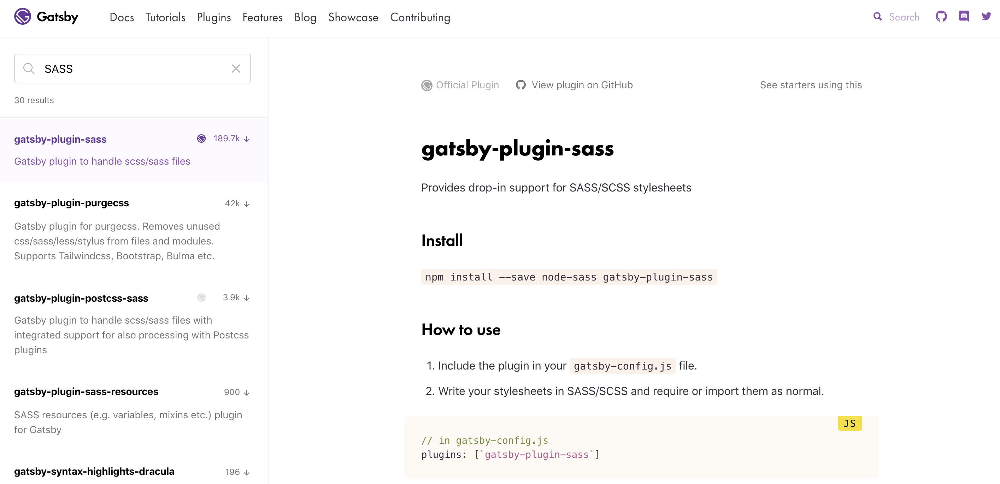
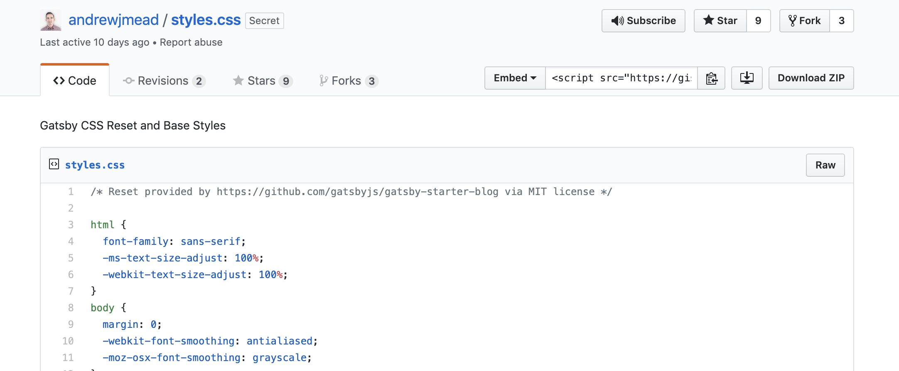
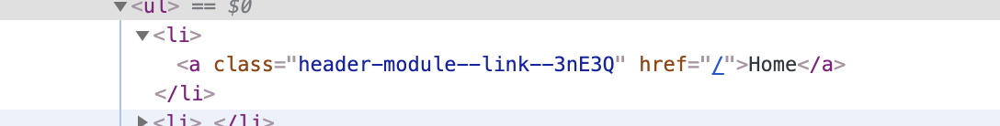
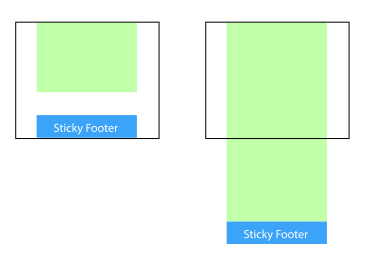

[목록으로](https://github.com/snowjang24/gatsby-practice)

# Gatsby와 React로 만드는 블로그

## ✏️스타일을 적용하기

### 일반적인 스타일 적용

이제 어느 정도 블로그의 틀은 잡았다. 하지만 아직 디자인으로 아무것도 없기 때문에 예쁘지 않다. 스타일을 적용하기 위해 `src/styles`를 만들고 `index.css`파일도 만든다. 테스트를 위해 모든 글자를 빨간색으로 만든다.

```css
*{
  color: red;
}
```

`Layout`에 한 줄만 추가하면 쉽게 style을 적용할 수 있다. 어렵지 않다.

```javascript
import "../styles/index.css"
```

하지만 일반적인 CSS 보다는 좀 더 유용하고 편한 SASS를 쓰는 것이 좋을 것 같기 때문에, gatsby의 sass관련 plugin을 쓰려 한다.

gatsby는 gatsby만의 유용한 plugin들을 제공하고 있다. 플러그인은 Gatsby에서 [plugins](https://www.gatsbyjs.org/plugins/)에 들어가 필요한 플러그인을 검색하여 설치 방법과 사용법을 확인 할 수 있다. sass를 검색하고 설명에 따라 플러그인을 설치한다.



플러그인을 설치하고, 루트 디렉토리에 있는 `gatsby-config.js`에 플러그인 문서를 따라 세팅한다.
```bash
npm install --save node-sass gatsby-plugin-sass
```

```javascript
module.exports = {
  // in gatsby-config.js
  plugins: [`gatsby-plugin-sass`],
}
```

그리고 `index.css`의 확장자를 `scss`로 바꿔 주고 Layout에 있는 `import`도 아래와 같이 바꾼다.

```javascript
import "../styles/index.scss"
```

편의를 위해 기본적인 스타일은 gatsby에서 제공하는 [기본 블로그 스타일](http://links.mead.io/gatsbystyles)을 가져온다. `index.scss`에 붙여넣기 하여 스타일을 적용한다.



<br>

### CSS Module을 이용한 스타일 적용

우리가 아는 일반적인 방법인 `class`이름을 통해 스타일을 적용할 경우, 다양한 페이지와 컴포넌트가 있는 상황에서는 클래스명이 같아 꼬이는 경우가 발생할 수 있다. 그렇기 때문에 **CSS Module**을 사용하여 적용한다. [veloport님의 블로그](https://velog.io/@velopert/react-component-styling#css-module)를 참고하면 이해하기 좋다.


CSS Module의 방법은 간단하다. 원래 스타일 시트의 이름이 `header.scss`면 `header.module.scss` 처럼 이름에 **module**을 붙여주면 된다. 

간단한 예시를 통해 확인하려 한다. `src/pages`에 `header.module.scss`를 생성한다. 그리고 다음과 같이 스타일을 작성하고 저장한다.

```css
.link {
  color: #999;
}
```

`Header`부분에 첫 번째 링크에 스타일 적용을 위해 다음과 같이 수정한다. `className`에 `{import한 스타일 시트 이름.class명}` 와 같이 작성하면 스타일을 쉽게 적용할 수 있다.

```javascript
import React from "react"
import { Link } from "gatsby"

import headerStyles from "./header.module.scss"

const Header = () => {
  return (
    <header>
      <h1>JSnow</h1>
      <nav>
        <ul>
          <li>
            <Link className={headerStyles.link} to="/">
              Home
            </Link>
          </li>
...
```

CSS Module이 적용된 `<Link>`의 클래스 이름을 보면 다음과 같이 식별자가 따로 붙어 있다. 이렇게 생성된 유니크한 클래스 이름으로 인해, 다른 컴포넌트에서 사용하는 클래스 이름과 중복되는 것을 방지할 수 있다.



이제 레이아웃에 대한 스타일을 만들어 주기 위해 동일한 폴더에 `layout.module.scss`를 만들어주고 같은 방식으로 `import`한다.

```scss
.container {
  margin: 0 auto;
  max-width: 750px;
  padding: 1rem;
}
```

```javascript
import React from "react"

import Header from "../components/header"
import Footer from "../components/footer"
import "../styles/index.scss"
import layoutStyles from "./layout.module.scss"

const Layout = props => {
  return (
    <div className={layoutStyles.container}>
      <Header />
      {props.children}
      <Footer />
    </div>
  )
}

export default Layout

```

Footer는 내용의 양에 상관 없이 항상 맨 아래에 붙어 있어야 한다. 보통 이것을 **Sticky Footer**라고 부른다. 



Sticky footer를 적용하기 위해 `<div>`하나를 생성하고 그 안에 Footer를 제외한 나머지를 넣어준다.

```javascript
const Layout = props => {
  return (
    <div className={layoutStyles.container}>
      <div>
        <Header />
        {props.children}
      </div>
      <Footer />
    </div>
  )
}
```

`.content`와 `.container`에 관한 스타일을 추가한 뒤 `.content`를 JSX에 추가한다.

```css
.container {
  margin: 0 auto;
  max-width: 750px;
  padding: 1rem;

  display: flex;
  flex-direction: column;
  min-height: 100vh;
}

.content {
  flex-grow: 1;
}
```

```javascript
const Layout = props => {
  return (
    <div className={layoutStyles.container}>
      <div className={layoutStyles.content}>
        <Header />
        {props.children}
      </div>
      <Footer />
    </div>
  )
}
```

몇가지 Header에 관한 스타일을 추가로 적용한다. 먼저 아까와 같이 `src/components`에 `header.module.scss`를 생성한다. 그런 다음 아래의 스타일을 작성하고 `header.js` 또한 수정한다.
```css
.header {
  padding: 1rem 0 3rem;
}

.title {
  color: #000000;
  font-size: 3rem;
  text-decoration: none;
}

.nav-list {
  display: flex;
  list-style-type: none;
  margin: 0;
}

.nav-item {
  color: #999;
  font-size: 0.9rem;
  margin-right: 1.3rem;
  text-decoration: none;
}

.nav-item:hover {
  color: #666666;
}

.active-nav-item {
  color: #333333;
}
```

```javascript
import React from "react"
import { Link } from "gatsby"

import headerStyles from "./header.module.scss"

const Header = () => {
  return (
    <header className={headerStyles.header}>
      <h1>
        <Link className={headerStyles.title} to="/">
          JSnow Blog
        </Link>
      </h1>
      <nav>
        <ul className={headerStyles.navList}>
          <li>
            <Link
              className={headerStyles.navItem}
              activeClassName={headerStyles.activeNavItem}
              to="/"
            >
              Home
            </Link>
          </li>
          <li>
            <Link
              className={headerStyles.navItem}
              activeClassName={headerStyles.activeNavItem}
              to="/blog"
            >
              Blog
            </Link>
          </li>
          <li>
            <Link
              className={headerStyles.navItem}
              activeClassName={headerStyles.activeNavItem}
              to="/about"
            >
              About
            </Link>
          </li>
          <li>
            <Link
              className={headerStyles.navItem}
              activeClassName={headerStyles.activeNavItem}
              to="/contact"
            >
              Contact
            </Link>
          </li>
        </ul>
      </nav>
    </header>
  )
}

export default Header
```