[목록으로](https://github.com/snowjang24/gatsby-practice)

# Gatsby와 React로 만드는 블로그

## ✏️블로그 데이터 다루기

### GraphQL

어느 정도 스타일 꾸미기가 끝났다. 이제 드디어 데이터를 다뤄보려고 한다. Gatsby는 [GraphQL](https://graphql.org/)을 이용한다. GraphQL은 API에 대한 쿼리 언어다. 기존에 우리가 흔히 아는 REST API는 여러 URL에서 데이터를 받아와야 하지만 GraphQL API는 한번의 요청으로 앱에 필요한 모든 데이터를 가져온다. 지금 블로그를 만드는 과정에서는 GraphQL의 깊은 부분까지 다루지 않는다. 따라서, 아직 따로 공부하지 않아도 된다. 자세히 알고싶다면 [번역된 공식 도큐먼트](https://graphql-kr.github.io/)를 읽으면 좋다.


우선 Gatsby는 아래의 그림과 같은 원리로 작동한다. 

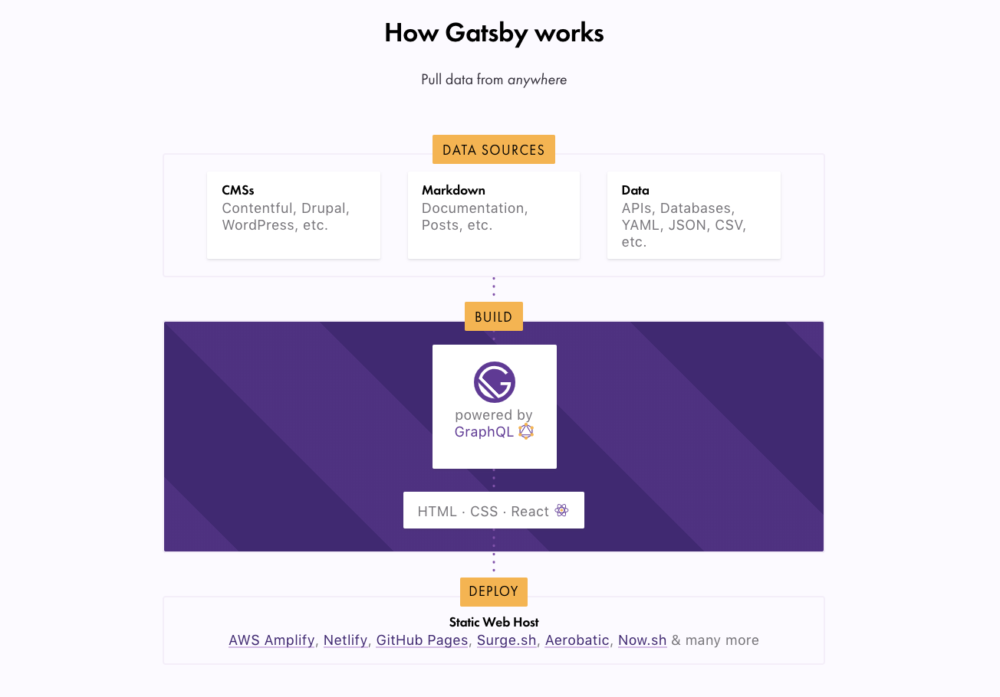

직접 작성한 데이터를 블로그 페이지에 나타내보려 한다. 보통 Hexo나 Jekyll의 테마들을 보면 대부분 블로그의 Author, Title 등 사이트 관련 메타 데이터를 한 파일에 작성하고 관리한다. 이와 동일하게 사이트에 관한 메타 데이터를 `gatsby-config`에 작성하고, 그 데이터를 페이지에 나타내고 싶다. 먼저 다음과 같이 페이지 제목과 작성자를 `siteMetadata`에 넣는다.

```javascript
module.exports = {
  siteMetadata: {
    title: "JSnow's dev blog",
    author: "Snow Jang",
  },
  // in gatsby-config.js
  plugins: [`gatsby-plugin-sass`],
}
```

<br>

### GraphiQL을 이용한 데이터 확인

graphql에서 데이터를 확인하려면 [GraphiQL](http://localhost:8000/__graphql)을 이용한다.[GraphiQL](https://github.com/graphql/graphiql)은 graphql 데이터를 확인하고 테스트할 수 있는, GraphQL에서 제공하는 GraphQL IDE다.

GraphiQL에 접속하면 아래와 같은 화면을 볼 수 있다. 여기서 왼쪽을 보면 쿼리를 작성할 수 있는데 왼편에 쿼리를 넣고 재생 버튼을 누르면 왼쪽에 결과를 볼 수 있다.

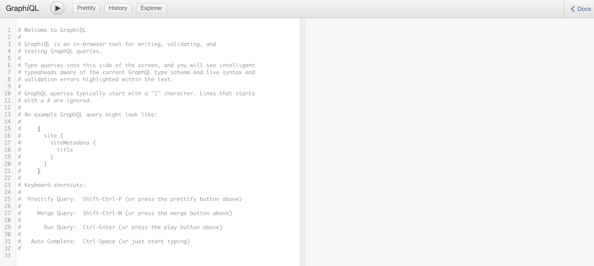

오른쪽 패널 끝의 윗부분에 있는 Docs를 누르면 아래와 같은 Explorer를 볼 수 있는데 이를 이용하여 어떠한 데이터가 어떤 타입을 가지고 있는지 확인할 수 있다.

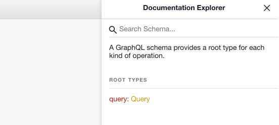

Graphql에는 **query**, **mutation**, **subscribtion** 3가지 주요한 operation이 있다. 우리는 그 중에 query를 주로 이용할 예정이다. 

`Query` > `Site` > `siteMetadata` 의 경로로 타고 들어가면 우리가 넣은 `title`과 `author`를 통해 우리가 필요한 데이터에 접근할 수 있다.

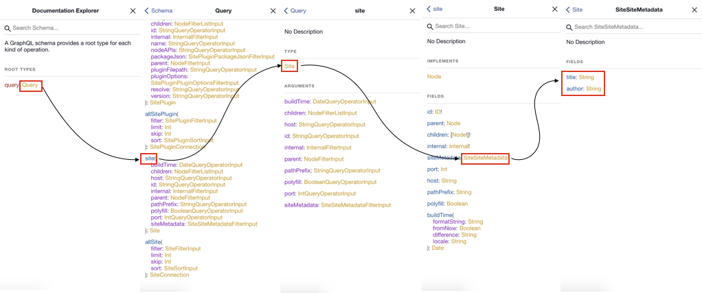

접근 경로를 알았으니 실제로 접근해서 동일한 결과가 나오는지 확인하면 다음과 같다.

```javascript
query {
  site {
    siteMetadata {
      title
    }
  }
}
```

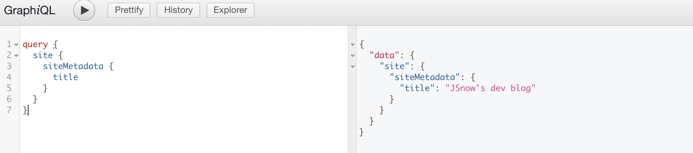

데이터에 접근 가능한 것을 확인했고, 이를 활용하여 웹 페이지의 Title을 반영하려면 다음과 같이 작성하면 된다. GraphQL을 제대로 이용하기 위해서는 `graphql`과 `useStaticQuery` 모듈을` import` 해서 쓴다. 그리고 `data` 변수에 `useStaticQuery()`메서드와 `graphql`메서드를 이용하여 데이터를 받아온다. 여기서 `graphql` 메서드의 이용 방식이 좀 특이하다 앞에서 썼던 쿼리를 Template string의 형식인 Backtick 사이에 넣어서 이용한다.

```javascript
import React from "react"
import { Link, graphql, useStaticQuery } from "gatsby"

import headerStyles from "./header.module.scss"

const Header = () => {
  const data = useStaticQuery(graphql`
    query {
      site {
        siteMetadata {
          title
        }
      }
    }
  `)

  return (
    <header className={headerStyles.header}>
      <h1>
        <Link className={headerStyles.title} to="/">
          {data.site.siteMetadata.title}
        </Link>
      </h1>
```

결과가 올바르게 반영 되었다.

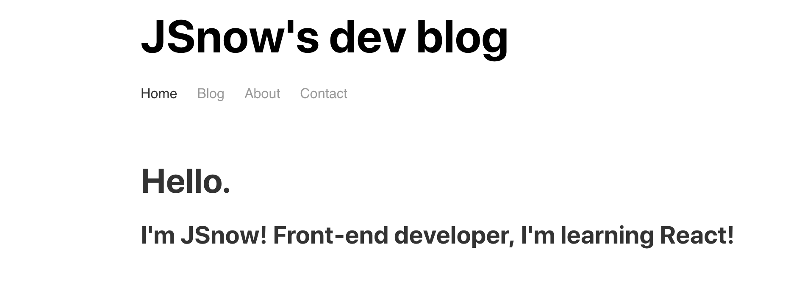

동일한 방법으로 한 번 `Footer`에 author이름을 적용하려면 다음과 같이 작성하면 된다.

```javascript
import React from "react"
import { graphql, useStaticQuery } from "gatsby"

const Footer = () => {
  const data = useStaticQuery(graphql`
    query {
      site {
        siteMetadata {
          author
        }
      }
    }
  `)
  return (
    <footer>
      <p>Created by {data.site.siteMetadata.author}, © 2019</p>
    </footer>
  )
}

export default Footer
```

로 두 개를 가져오고 싶으면 다음과 같이 작성하여 둘 다 가져올 수 있다.

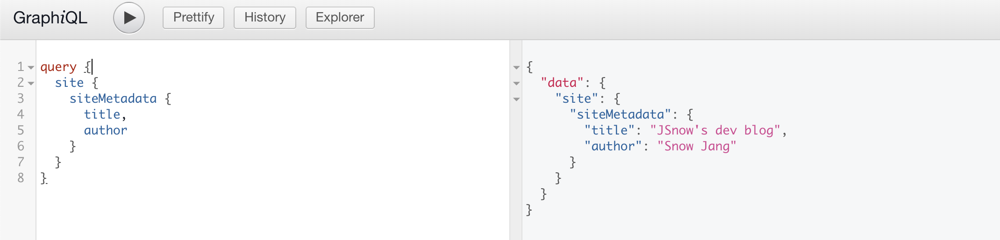

<br>

### GraphQL Playground !

graphiql도 유용하지만 좀 더 유용한 도구를 사용해보려 한다. [graphql playground](https://github.com/prisma/graphql-playground)는 GraphiQL와 유사하지만 유용한 기능이 많기 때문에, 좀 더 편한 로컬 개발이 가능하다. 

Playground를 사용하기 위해서 루트 폴더에 `.env.development`라는 환경 파일을 만든다. 그리고 다음과 같이 작성하면 된다.

```
GATSBY_GRAPHQL_IDE=playground
```

가동중이던 서버를 끄고 필요한 라이브러리를 하나 받는다.

```bash
npm install --save-dev env-cmd
```

그리고 이를 이용하기 위해 `package.json`에 있는 `scripts`의  `develop` 부분을 다음과 같이 수정한다.

```json
"develop": "env-cmd .env.development gatsby develop",
```

이제 세팅을 다 끝내고 `npm run develop`으로 서버를 키면 다음과 같은 에러를 만나게 된다. 
```bash
> npm run develop

> gatsby-starter-hello-world@0.1.0 develop /Users/soonho/project/gatsby-practice
> env-cmd .env.development gatsby develop

Error: Unable to locate env file at default location (./.env)
    at /Users/soonho/project/gatsby-practice/node_modules/env-cmd/dist/get-env-vars.js:44:19
    at Generator.throw (<anonymous>)
    at rejected (/Users/soonho/project/gatsby-practice/node_modules/env-cmd/dist/get-env-vars.js:5:65)
    at processTicksAndRejections (internal/process/task_queues.js:89:5)
npm ERR! code ELIFECYCLE
npm ERR! errno 1
npm ERR! gatsby-starter-hello-world@0.1.0 develop: `env-cmd .env.development gatsby develop`
npm ERR! Exit status 1
npm ERR! 
npm ERR! Failed at the gatsby-starter-hello-world@0.1.0 develop script.
npm ERR! This is probably not a problem with npm. There is likely additional logging output above.

npm ERR! A complete log of this run can be found in:
npm ERR!     /Users/soonho/.npm/_logs/2019-06-19T13_22_21_553Z-debug.log
```

이 내용에 관해서는 [Using the GraphQL Playground](https://www.gatsbyjs.org/docs/using-graphql-playground/)를 참고하면 좋을 것 같다. 오류를 해결하기 위해서 다음과 같이 `-f`를 가운데에 추가하여 저장하고 다시 `npm run develop`를 실행한다.

```json
"develop": "env-cmd -f .env.development gatsby develop",
```

이제 준비가 다 끝났다. [http://localhost:8000/___graphql](http://localhost:8000/___graphql)로 접속하면 아까와는 다른 어두운 화면이 나온다. 바로 GraphQL playground다. 아까의 GraphiQL과 동일하게 작동하지만 기능이 좀 더 많고 보기 편하다.

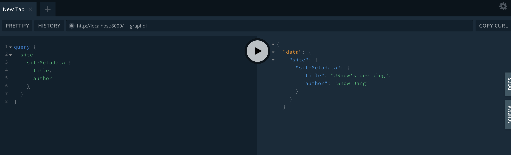

탭 기능도 있어서 여러개 만들 수 있고 DOCS기능도 expand형식으로 되어있어 더 보기 쉽다.

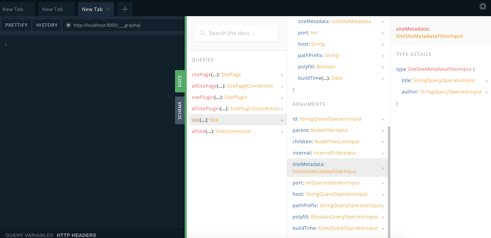

<br>

### 본격적으로 포스트 가져오기

이제 본격적으로 포스트를 가져올 수 있는 기능을 넣어보려 한다. 이를 위해 `src/posts` 폴더를 생성하고 안에 `gatsby.md`와 `react.md`를 만든다.

```markdown
---
title: "Gatsby를 사용하는 방법"
date: "2019-04-04"
---

Gatsby를 이용하여 블로그를 만들기 위해서는 다음과 같은 사전지식이 필요하다.

## 블로그를 만들기 위해 알아야 할 것들

1. Gatsby & Netlify
2. React
3. GraphQL
```

```markdown
---
title: "React를 처음 접했을 때"
date: "2019-04-02"
---

React는 정말 좋은 Framework다!
```

이제 재료는 준비되었으니 도구가 필요하다. 이전과 동일하게 [플러그인 검색 페이지](https://www.gatsbyjs.org/packages/gatsby-source-filesystem/?=source)에서 **source**를 검색한다. Gatsby에는 source를 다루는 다양한 플러그인이 존재한다. 그 중 우리는 **gatsby-source-filesystem**을 이용하려 한다.

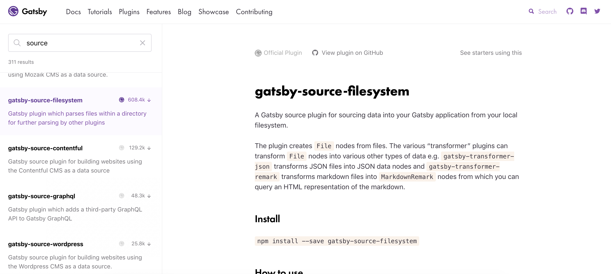

npm을 통해 설치하고 `gatsby-config.js` 파일의 `plugins`부분에 추가로 옵션을 넣어 준다. 여기서 `__dirname`을 통해 현재 프로젝트 폴더 이름을 가져온다.

```bash
npm install --save gatsby-source-filesystem
```

```javascript
plugins: [
    `gatsby-plugin-sass`,
    {
      resolve: "gatsby-source-filesystem",
      options: {
        name: "src",
        path: `${__dirname}/src/`,
      },
    },
  ],
```

이렇게 옵션을 추가하고 서버를 다시 재실행하면 다음과 같이 queries에 추가로 file과 directory관련 query가 추가된 것을 확인할 수 있다.

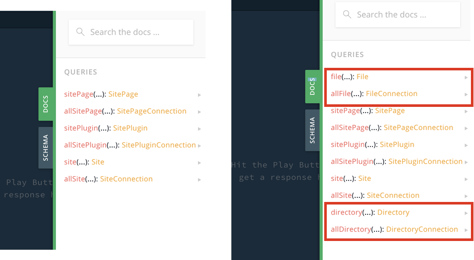

그러고나서 playground에서 다음과 같이 query를 작성하면 프로젝트 내의 `name`, `extentison`, `dir`에 관한 정보를 받을 수 있다.

```
query{
  allFile{
    edges{
      node{
        name
        extension
        dir
      }
    }
  }
}
```

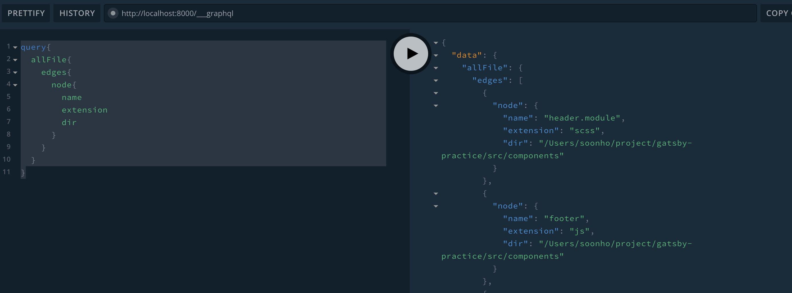

오른쪽 결과탕에서 맨 아래로 내려가면 생성한 post를 확인할 수 있다.

```
{
  "node": {
    "name": "react",
    "extension": "md",
    "dir": "/Users/soonho/project/gatsby-practice/src/posts"
  }
},
{
  "node": {
    "name": "gatsby",
    "extension": "md",
    "dir": "/Users/soonho/project/gatsby-practice/src/posts"
  }
}
```
<br>

### 마크다운을 변환!

마크다운을 불러올 수 있는 점을 확인 했다. 이제 마크다운을 변환시켜 주기 위해 새로운 플러그인을 설치해야 한다. 마찬가지로 플러그인 검색 페이지에서 **REMARK**를 검색하여 [gatsby-transformer-remark](https://www.gatsbyjs.org/packages/gatsby-transformer-remark/?=remark)를 설치한다. 여기서 remark는 markdown파일을 파싱해주는 자바스크립트 라이브러리다.

```bash
npm install --save gatsby-transformer-remark
```

그리고 `gatsby-config.js`의 `plugins`를 다음과 같이 수정한다.

```javascript
plugins: [
    `gatsby-plugin-sass`,
    {
      resolve: "gatsby-source-filesystem",
      options: {
        name: "src",
        path: `${__dirname}/src/`,
      },
    },
    `gatsby-transformer-remark`,
  ],
```

다시 graphql playground에 접속하면 다음과 같이 두개의 새로운 항목이 생긴것을 확인할 수 있다.

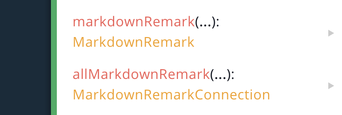

* `markdownRemark`는 개별적인 post를 fetch한다. 
* `allMarkdownRemark`는 post목록을 fetch한다.

우리는 `allMarkdownRemark`를 활용하여 블로그 리스트를 만드는 페이지를 완성하려 한다.

`allMarkdownRemark` > `edges` > `node` > `frontmatter`를 타고 들어가, 살펴보면 다음과 같이 `title`과`date`를 볼 수 있다.

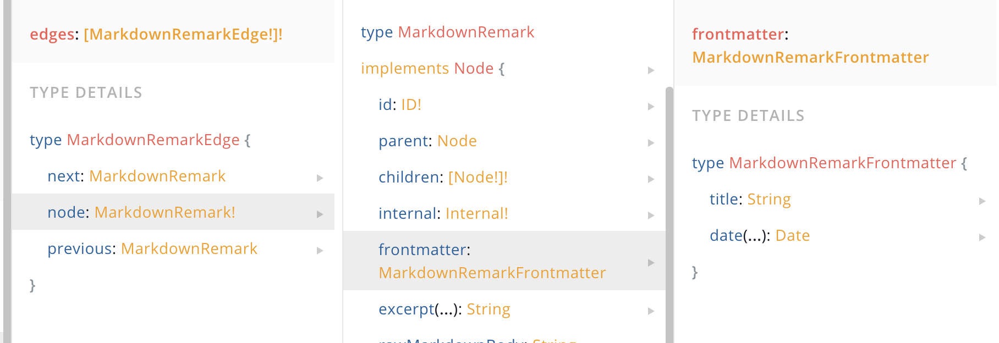

이제 실제 graphql로 잡아서 어떤 데이터를 불러 올 수 있는지 보면 다음과 같다. 결과에 다행스럽게도 아까 만든 post들의 `title`과 `date`를 확인할 수 있다.

```javascript
query{
  allMarkdownRemark{
    edges{
      node{
        frontmatter{
          title
          date
        }
      }
    }
  }
}
```

```javascript
{
  "data": {
    "allMarkdownRemark": {
      "edges": [
        {
          "node": {
            "frontmatter": {
              "title": "Gatsby를 사용하는 방법",
              "date": "2019-04-04"
            }
          }
        },
        {
          "node": {
            "frontmatter": {
              "title": "React를 처음 접했을 때",
              "date": "2019-04-02"
            }
          }
        }
      ]
    }
  }
}
```

`frontmatter` 외에 `html`과 `excerpt`를 추가하면 다음과 같은 결과를 얻을 수 있다. 여기서 `html`은 우리가 아는 그 HTML이다. 마크다운으로 작성된 한 페이지를 HTML로 변환한 값을 담고 있다. 그리고 `excerpt`는 일종의 요약문과도 같다. 포스트의 맨 위에서부터 차례로 일정량의 글을 발췌한다.

```javascript
query{
  allMarkdownRemark{
    edges{
      node{
        frontmatter{
          title
          date
        }
        html
        excerpt
      }
    }
  }
}
```

```javascript
"data": {
    "allMarkdownRemark": {
      "edges": [
        {
          "node": {
            "frontmatter": {
              "title": "Gatsby를 사용하는 방법",
              "date": "2019-04-04"
            },
            "html": "<p>Gatsby를 이용하여 블로그를 만들기 위해서는 다음과 같은 사전지식이 필요하다.</p>\n<h2>블로그를 만들기 위해 알아야 할 것들</h2>\n<ol>\n<li>Gatsby &#x26; Netlify</li>\n<li>React</li>\n<li>GraphQL</li>\n</ol>",
            "excerpt": "Gatsby를 이용하여 블로그를 만들기 위해서는 다음과 같은 사전지식이 필요하다.블로그를 만들기 위해 알아야 할 것들Gatsby & NetlifyReactGraphQL"
          }
        },
```

이 글의 제목과 시간을 실제 블로그 페이지에 불러오려면 다음과 같이 `blog.js`에 작성하면 된다.

```javascript
import React from "react"
import { graphql, useStaticQuery } from "gatsby"

import Layout from "../components/layout"

const BlogPage = () => {
  const data = useStaticQuery(graphql`
    query {
      allMarkdownRemark {
        edges {
          node {
            frontmatter {
              title
              date
            }
          }
        }
      }
    }
  `)

  console.log(data)
  return (
```

다음과 같이 불러올 수 있음을 확인할 수 있다.

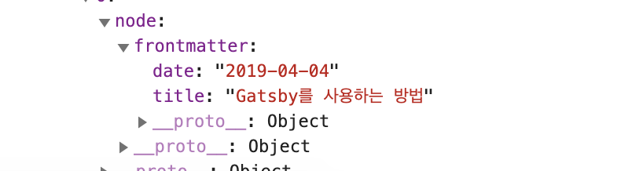

이제 뿌려주는 일만 남았다. 각각의 글 목록은 `<ol>`을 통해 뿌려진다. 이를 위해 `map()`을 이용한다.

```javascript
	return (
    <Layout>
      <h1>Blog</h1>
      <ol>
        {data.allMarkdownRemark.edges.map(edge => {
          return (
            <li>
              <h2>{edge.node.frontmatter.title}</h2>
              <p>{edge.node.frontmatter.date}</p>
            </li>
          )
        })}
      </ol>
    </Layout>
  )
}
```

리스트에 대한 오류는 일단 무시하고 넘어간다. 신경이 쓰인다면 [여기](https://ko.reactjs.org/docs/lists-and-keys.html)를 참고하여 코드를 수정하면 된다.

```bash
Warning: Each child in a list should have a unique "key" prop.
```

