**[← 목록으로](https://github.com/snowjang24/gatsby-practice#-목록)**

# Gatsby와 React로 만드는 블로그

## ✏️마크다운을 페이지로!

### 동적 주소 생성

블로그 post를 선택하면 페이지와 그 주소가 동적으로 생성되도록 하고싶다. root폴더에 `gatsby-node.js`를  생성한다. 그런 다음 gatsby의 DOCS 페이지에서 API REFERENCE의 [Gatsby Node APIs](https://www.gatsbyjs.org/docs/node-apis/) 에서 필요한 api를 찾아본다.

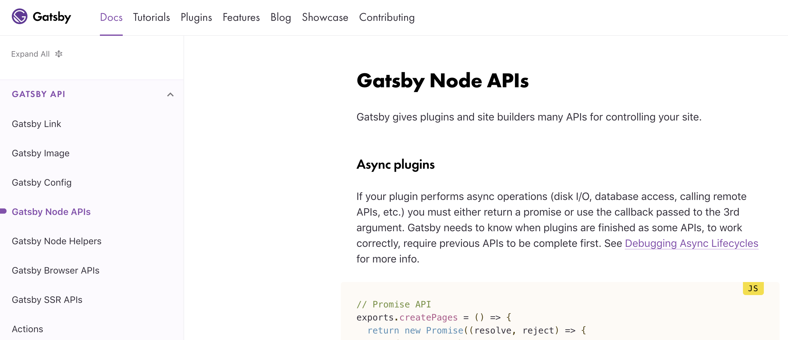

페이지 생성시 관련 데이터 처리를 위해 `onCreateNode` 를 사용할 것이다. 

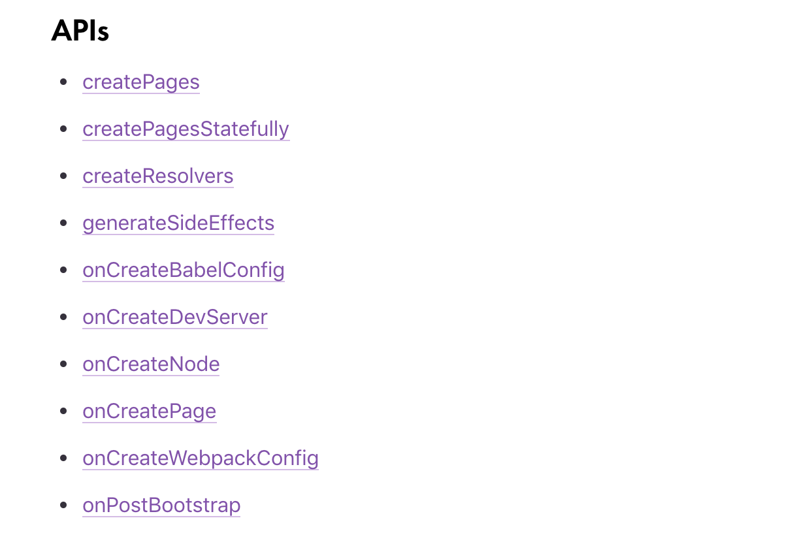

`onCreateNode`의 예시에 보면 매개변수로  `node`가 나오는데, 이 `node` 는 `query`에서 보았던 바로 그 `node`다. 각 post를 뜻한다고 보면 이해하기 쉽다.

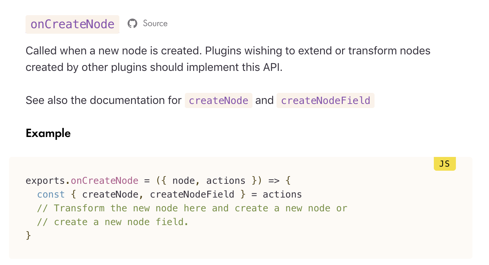

아까 생성한 `gatsby-node.js`에 다음과 같이 작성한다. 일단, `createNode`는 아직 사용하지 않는다. 먼저 확인을 위해 콘솔로 한 번 찍어본다. 이를 위해 서버를 다시 시작한다. 

```javascript
module.exports.onCreateNode = ({ node, actions }) => {
  const { createNodeField } = actions
  console.log(JSON.stringfy(node, undefined, 4))
}
```

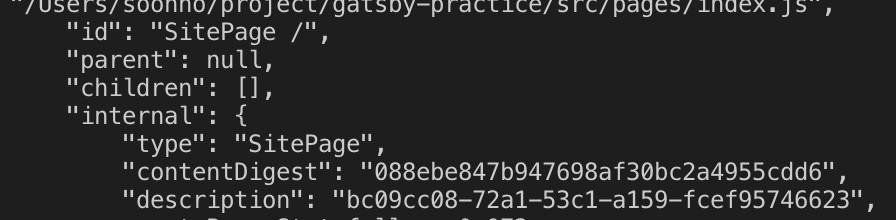

여기서 우리는 `internal` > `type` 중 `MarkdownRemark`로 된 데이터만 뽑고 싶다. 다시 다음과 같이 고친 이후 출력한다.

```javascript
module.exports.onCreateNode = ({ node, actions }) => {
  const { createNodeField } = actions
  if (node.internal.type === "MarkdownRemark") {
    console.log(JSON.stringify(node, undefined, 4))
  }
}
```

출력해보면 다음과 같이 나온다. 여기서 중요한 것은 현재 나와있는 `fileAbsolutePath`를 이용할 것이라는 점이다.

```javascript
{
    "id": "809ad49b-0045-5668-a92a-556b2295bc3c",
    "children": [],
    "parent": "7b04ea0b-802c-504b-bfa7-fa3593bdf53c",
    "internal": {
        "content": "\nReact는 정말 좋은 Framework다!",
        "type": "MarkdownRemark",
        "contentDigest": "1bb5ac23b81d05f31949bb2d2594f198",
        "owner": "gatsby-transformer-remark"
    },
    "frontmatter": {
        "title": "React를 처음 접했을 때",
        "date": "2019-04-02"
    },
    "excerpt": "",
    "rawMarkdownBody": "\nReact는 정말 좋은 Framework다!",
    "fileAbsolutePath":
"/Users/soonho/project/gatsby-practice/src/posts/react.md"
```

이제 이 절대 경로에서 파일의 이름만 뽑아낼 것이다. 이를 위해 Node.js에서 [path와 관련된 모듈](https://nodejs.org/dist/latest-v10.x/docs/api/path.html)을 가져와 사용한다. `path.basename` 을 사용할 것이다.

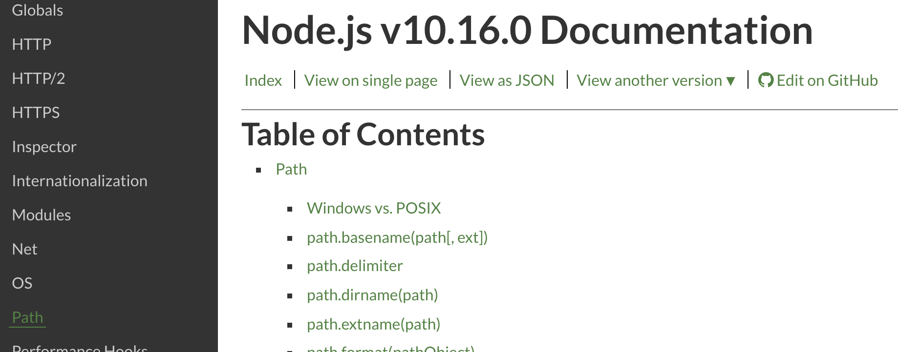

다음과 같이 작성하고 확인하면 우리가 만든 포스트의 확장자를 제외한 이름이 출력된다. 이 이름을 `slug`라는 변수에 담는다. 여기서 **[Slug](https://en.wikipedia.org/wiki/Clean_URL#Slug)**는 사람이 읽을 수 있는 키워드를 이용하는 URL의 한부분이다.

```javascript
const path = require("path")

module.exports.onCreateNode = ({ node, actions }) => {
  const { createNodeField } = actions
  if (node.internal.type === "MarkdownRemark") {
    const slug = path.basename(node.fileAbsolutePath, ".md")
    console.log("@@@@@@@@@@@", slug)
  }
}
```

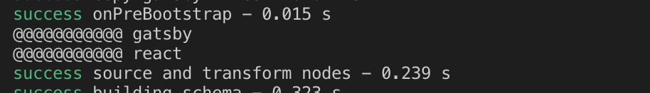

절대 경로에서 파일 이름만 분리하였다. 다음과 같이 작성하여 `slug`를 `query`에 넣어준다. 

```javascript
const path = require("path")

module.exports.onCreateNode = ({ node, actions }) => {
  const { createNodeField } = actions
  if (node.internal.type === "MarkdownRemark") {
    const slug = path.basename(node.fileAbsolutePath, ".md")
    createNodeField({
      node,
      name: "slug",
      value: slug,
    })
  }
}
```

Playground를 들어가서 결과를 출력하면 다음과 같다.

```javascript
query{
  allMarkdownRemark{
    edges{
      node{
        frontmatter{
          title
          date
        }
        html
        excerpt
        fields{
          slug
        }
      }
    }
  }
}
```

```javascript
{
  "data": {
    "allMarkdownRemark": {
      "edges": [
        {
          "node": {
            "frontmatter": {
              "title": "React를 처음 접했을 때",
              "date": "2019-04-02"
            },
            "html": "<p>React는 정말 좋은 Framework다!</p>",
            "excerpt": "React는 정말 좋은 Framework다!",
            "fields": {
              "slug": "react"
            }
          }
        },

```

<br>

### 블로그 포스트 페이지 연결하기

주소를 동적으로 생성했다. 이제는 블로그 포스트의 템플릿을 만들어 마크다운 파일을 

우선 `src/templates` 폴더를 만들고 `blog.js`를 생성한다.

```javascript
import React from "react"

import Layout from "../components/layout"

const Blog = () => {
  return <Layout>This is post that i created!</Layout>
}

export default Blog
```

[createPages](https://www.gatsbyjs.org/docs/node-apis/#createPages)라는 페이지를 생성하는 gasby api가 있다. 이를 이용하기 위해서는 `gastby-node.js` 에 다음과 같이 코드를 추가한다.

```javascript
exports.createPages = ({ graphql, actions }) => {
  const { createPage } = actions
  const blogTemplate = path.resolve("./src/templates/blog.js")
}
```

필요한 데이터를 가져오는데 필요한 정보는 `slug` 뿐이기 때문에, 다음과 같이 query를 추가하여 데이터를 가져온다. 이때 `graphql`은 앞에서 우리가 쓰던 `graphql`모듈과 달리 그 자체가 메서드 이기 때문에 메서드의 방식으로 query를 추가하여 사용한다.

```javascript
exports.createPages = ({ graphql, actions }) => {
  const { createPage } = actions
  const blogTemplate = path.resolve("./src/templates/blog.js")
  graphql(`
    query {
      allMarkdownRemark {
        edges {
          node {
            fields {
              slug
            }
          }
        }
      }
    }
  `)
}
```

여기서 `graphql`메서드는 `return` 값으로 `Promise`객체를 반환한다. `async`와 `await`를 통해 비동기 처리를 해줘야한다. createPage를 통해 각각 필요한 인자를 넘겨준다. 여기서 `res`는 response를 뜻한다.

```javascript
exports.createPages = async ({ graphql, actions }) => {
  const { createPage } = actions
  const blogTemplate = path.resolve("./src/templates/blog.js")
  const res = await graphql(`
    query {
      allMarkdownRemark {
        edges {
          node {
            fields {
              slug
            }
          }
        }
      }
    }
  `)

  res.data.allMarkdownRemark.edges.forEach(edge => {
    createPage({
      component: blogTemplate,
      path: `/blog/${edge.node.fields.slug}`,
      context: {
        slug: edge.node.fields.slug,
      },
    })
  })
}
```

다시 서버를 껐다 키면 생성된 페이지에 접근할 수 있는데, 아직은 링크를 이어주지 않았기 때문에, 직접 페이지 주소로 접근해야 한다. slug에 따라 `localhost:8000/blog/react`와 `localhost:8000/blog/gatsby` 접속해보면 올바르게 접근할 수 있음을 확인할 수 있다.


만약에 없는 페이지의 주소로 접근하면 어떤 페이지가 생성되었는지 확인할 수 있다.

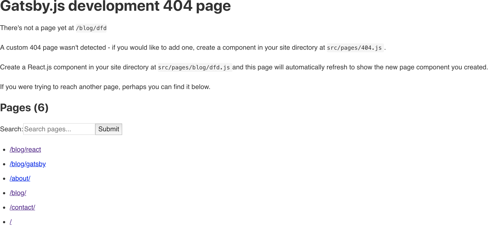

이제 접근 링크를 이어준다. `src/pages` 에 있는 `blog.js` 에서 `gatsby`의 `Link` 모듈을 가져온다. `src/templates` 에 있는 파일이 아님을 명심해야 한다.

```javascript
import { Link, graphql, useStaticQuery } from "gatsby"
```

그리고 페이지를 이어주기 위해 필요한 데이터인 `slug`를 쿼리에 추가한다.

```javascript
const data = useStaticQuery(graphql`
    query {
      allMarkdownRemark {
        edges {
          node {
            frontmatter {
              title
              date
            }
            fields {
              slug
            }
          }
        }
      }
    }
  `)
```

그런 다음 `Link`모듈을 이용하여 링크를 생성한다. 아까 생성한 페이지를 링크를 클릭하여 접근할 수 있게 되었다.

```javascript
 return (
    <Layout>
      <h1>Blog</h1>
      <ol>
        {data.allMarkdownRemark.edges.map(edge => {
          return (
            <li>
              <Link to={`/blog/${edge.node.fields.slug}`}>
                <h2>{edge.node.frontmatter.title}</h2>
                <p>{edge.node.frontmatter.date}</p>
              </Link>
            </li>
          )
        })}
      </ol>
    </Layout>
  )
```

<br>

### 블로그 포스트 페이지 생성하기

Post 목록에서 글을 클릭하면 블로그 포스트 글 페이지로 넘어갈 수 있게 만들었다. 이제 각 포스트가 각각에 맞는 데이터를 가져와 화면에 뿌릴 수 있게끔 만드려고 한다. 

다시 playground로 가서 필요한 데이터를 확인하면 다음과 같다. 조건부 탐색처럼 원하는 값을 지정하여 가져오고싶으면 query의 인자를 이용하면 된다. `slug`에  `eq`를 지정하여 가져오려고 한다. 여기서 `eq`는 equal이다. 그 아래에 `ne`의 경우 not equal을 뜻하며 그 외에 다양한 방법으로 지정 탐색할 수 있다.

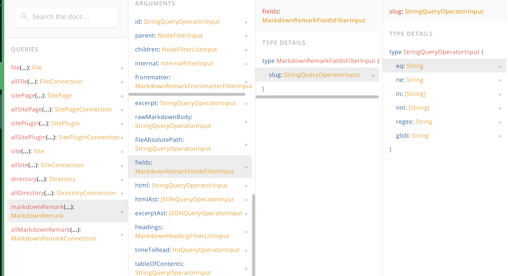

이 `eq`를 쓰는 방법은 간단하다. 앞에서 보통 데이터를 가져올 때 다음과 같이 query를 작성하여 데이터를 가져왔다.

```javascript
query{
  markdownRemark{
    frontmatter{
      title
    }
  }
}
```

여기에 조건을 주기 위해 graphql에서는 인자를 넣을 수 있다. 이 인자를 기준으로 원하는 데이터를 탐색할 수 있게 되는 것이다. `markdownRemark`에 인자를 넣어 조건에 맞는 데이터를 가져오기 위해서는 다음과 같이 작성한다.

```javascript
query{
  markdownRemark (
    fields:{
      slug:{
        eq: "react"
      }
    }
  ){
    frontmatter{
      title
    }
  }
}
```

`slug`가 `"react"`인 데이터만 불러왔다.

```javascript
{
  "data": {
    "markdownRemark": {
      "frontmatter": {
        "title": "React를 처음 접했을 때"
      }
    }
  }
}
```

하지만 이걸 매번 지정할 수 없기 때문에, 제대로 쓰기 위해서는 **query variables**를 함께 이용해야 한다. 화면 아래의 QUERY VARIABLES를 클릭하면 콘솔창 하나가 나오는데 여기에 값을 넣어 주고 query 자체에 인자를 받을 수 있게 바꿔준다. 

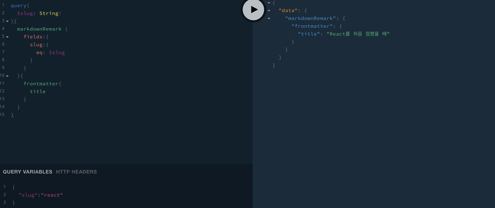

아래와 같이 작성한다.

```javascript
query(
  $slug: String!
){
  markdownRemark (
    fields:{
      slug:{
        eq: $slug
      }
    }
  ){
    frontmatter{
      title
    }
  }
}
```

그리고 query variables를 아래와 같이 작성하면 아까와 동일하게 `slug`가 `"react"`인 결과를 출력한다.

```javascript
{
  "slug" : "react"
}
```

만약 여기서 `"slug":"react"`를 `"slug":"gatsby"`로 변경하면 이에 맞는 결과가 출력된다.

이제 이 query를 직접 사용하기 위해서 `src/templates`의 `blog.js`에 다음과 같이 작성한다. 여기서 앞에서와 같이 `useStaticQuery`를 이용한 방법으로는 쿼리를 불러올 수 없다. 동적으로 데이터를 할당할 경우 아래와 같이 사용해야 한다. query를 `export`하고 이를 불러와서 사용해야 한다.

```javascript
import React from "react"
import { graphql } from "gatsby"

import Layout from "../components/layout"

export const query = graphql`
  query($slug: String!) {
    markdownRemark(fields: { slug: { eq: $slug } }) {
      frontmatter {
        title
        date
      }
      html
    }
  }
`

const Blog = props => {
  return (
    <Layout>
      <h1>{props.data.markdownRemark.frontmatter.title}</h1>
      <p>{props.data.markdownRemark.frontmatter.date}</p>
    </Layout>
  )
}

export default Blog

```

제목과 날짜는 올바르게 불러왔다. 여기에 내용에 해당하는 부분을 불러오는데, 이때는 react의 `dangerouslySetInnerHTML`을 이용한다. 자세한 내용은 [여기](https://reactjs.org/docs/dom-elements.html)를 참조한다.

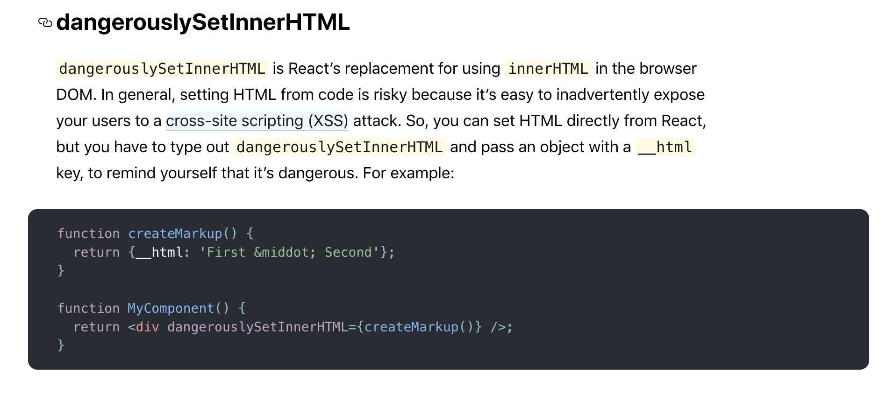

```javascript
const Blog = props => {
  return (
    <Layout>
      <h1>{props.data.markdownRemark.frontmatter.title}</h1>
      <p>{props.data.markdownRemark.frontmatter.date}</p>
      <div
        dangerouslySetInnerHTML={{ __html: props.data.markdownRemark.html }}
      ></div>
    </Layout>
  )
}
```

올바르게 데이터를 가져와서 뿌려주고 있다.

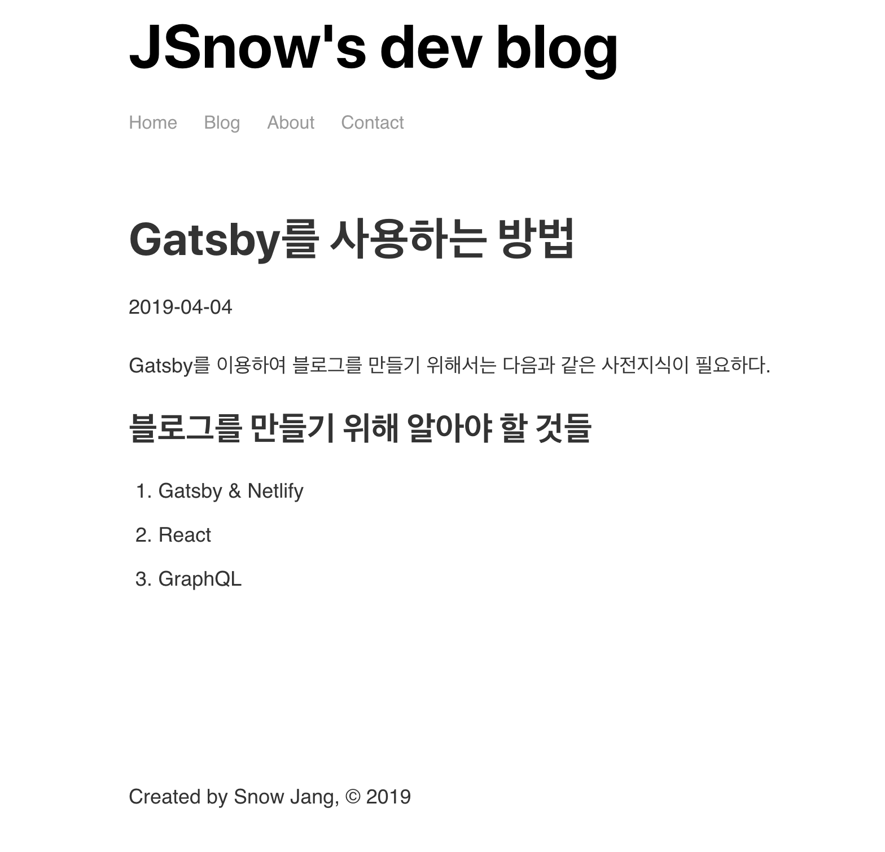
