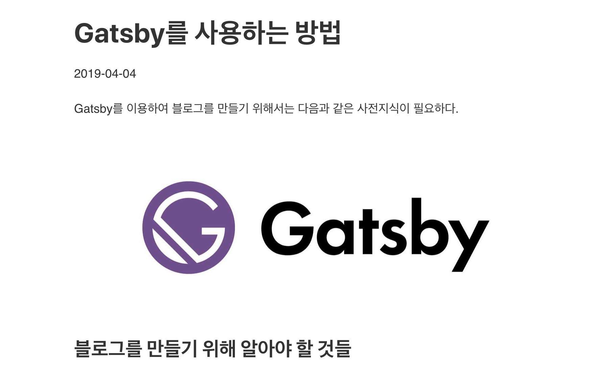
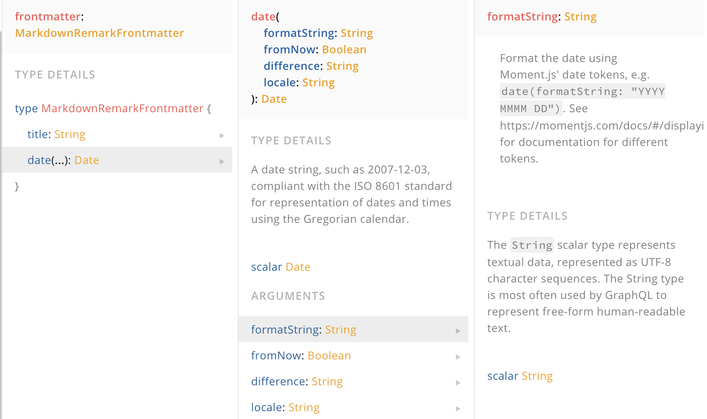
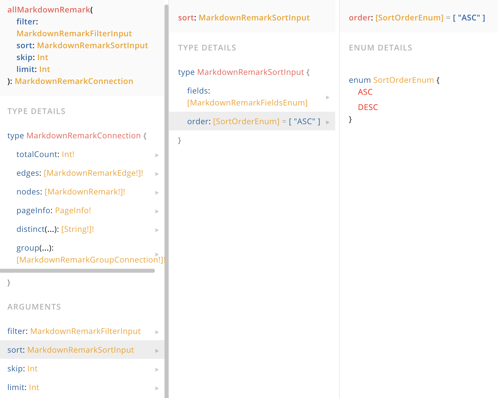

[목록으로](https://github.com/snowjang24/gatsby-practice)

# Gatsby와 React로 만드는 블로그

## ✏️추가적인 세팅

### Post에 이미지 더하기

당장 이 글만 봐도 그렇고 블로그에 이미지를 넣는 경우는 흔하다. 마크다운으로 작성한 글의 이미지를 3가지 플러그인을 설치하여 쉽게 처리할 수 있다.

아무 이미지나 `src/posts`에 넣는다. 그리고 `gatsby.md`에 다음과 같이 Markdown에 맞는 이미지 경로를 설정하여 하나 만든다.

```markdown

```

이제 다시 서버를 끄고 플러그인들을 설치한다

```bash
npm install gatsby-plugin-sharp gatsby-remark-images gatsby-remark-relative-images
```

그리고 `gastby-config.js`를 다음과 같이 수정한다.

```javascript
module.exports = {
  siteMetadata: {
    title: "JSnow's dev blog",
    author: "Snow Jang",
  },
  // in gatsby-config.js
  plugins: [
    "gatsby-plugin-sass",
    {
      resolve: "gatsby-source-filesystem",
      options: {
        name: "src",
        path: `${__dirname}/src/`,
      },
    },
    "gatsby-plugin-sharp",
    {
      resolve: "gatsby-transformer-remark",
      options: {
        plugins: [
          "gastby-remark-relative-images",
          {
            resolve: "gastby-remark-images",
            opsions: {
              maxWidth: 750,
              linkImagesToOriginal: false,
            },
          },
        ],
      },
    },
  ],
}
```

다시 실행하면 이미지가 잘 들어가는 것을 확인할 수 있다.



필요하다면, `src/posts/gatsby`를 생성하여 `gatsby.md`와 `gatsby-image.jpg` 를 옮겨서 이미지와 마크다운 문서를 함께 관리할 수 있다.

추가로 `footer`가 너무 붙어 있고 스타일이 없어 마치 글의 연장선으로 보인다. 이를 위해, `footer`에 스타일을 추가한다. `footer.module.scss` 를 만들고 다음과 같은 스타일을 추가한다.

```css
.footer {
  margin-top: 3rem;
}
```

css module의 방식으로 `footer` 에 스타일을 이어준다.

```javascript
import footerStyles from "./footer.module.scss"
...
  return (
    <footer className={footerStyles.footer}>
      <p>Created by {data.site.siteMetadata.author}, © 2019</p>
    </footer>
  )
```

그리고 블로그 글 목록을 좀 더 꾸미기 위해 다음과 같이 코드를 작성한다. `src/pages`에 `blog.module.scss`를 생성한다.

```css
.posts {
  list-style-type: none;
  margin: 0;
}
```

```javascript
import blogStyles from "./blog.module.scss"
...
 return (
    <Layout>
      <h1>Blog</h1>
      <ol className={blogStyles.posts}>
```

`<li>`와 `<h2>`, `<p>`에 스타일을 주려 하는데, 이렇게 하나하나 적용하는 방식은 번거롭다. 한꺼번에 적용하고 싶다. 먼저 `<li>`에 했던 방식대로 스타일을 적용하면 다음과 같다.

```css
.post {
  margin: 1rem 0;
}
```

```javascript
return (
  <li className={blogStyles.post}>
    <Link to={`/blog/${edge.node.fields.slug}`}>
      <h2>{edge.node.frontmatter.title}</h2>
      <p>{edge.node.frontmatter.date}</p>
    </Link>
  </li>
)
```

scss를 활용하면 하나하나 적용할 필요 없이 `.post`에 스타일을 적용하고 하위에 있는 요소들은 쉽게 적용할 수 있다. 무엇보다 보기에도 편하고 깔끔하다.

```scss
.post {
  margin: 1rem 0;
  a {
    background: #f4f4f4;
    color: #000;
    display: block;
    padding: 1rem;
    text-decoration: none;
  }
  a:hover {
    background: #e4e4e4;
  }
  h2 {
    margin-bottom: 0;
  }
  p {
    color: #777777;
    font-size: 0.8rem;
    font-style: italic;
  }
}
```
<br>

### 날짜 포맷 변환

날짜 포맷 변환은 어렵지 않다. `src/pages/blog.js`에서 앞서 사용했던 쿼리를 조금 수정하면 된다. 우선 Playground에서 확인한다. 원래의 쿼리대로 타고가다 보면 `date`를 만나는데 이 `date` 안에는 `formatString` 이라는 매개변수가 있다. 이 매개변수에 값을 할당하여 날짜 형식을 변경할 수 있다.



다양한 날짜 형식이 있는데 [momentjs](https://momentjs.com/)를 참고하여 원하는 날짜 형식을 선택하면 된다.

```javascript
query {
      allMarkdownRemark {
        edges {
          node {
            frontmatter {
              title
              date(formatString: "MMMM Do, YYYY")
            }
            fields {
              slug
            }
          }
        }
      }
    }
```

추가로 sort기능도 추가 할 수 있다. 글의 경우 최신 글이 맨 위로 있기 때문에 그에 맞게 변경해야한다.



`frontmatter`내부에 있는 `date`를 기준으로 하기 때문에 다음과 같이 작성하여 이용한다.

```javascript
query {
      allMarkdownRemark (
        sort:{
          fields: frontmatter___date
          order:DESC
        }
      ){
        edges {
          node {
            frontmatter {
              title
              date(formatString: "MMMM Do, YYYY")
            }
            fields {
              slug
            }
          }
        }
      }
    }
```
