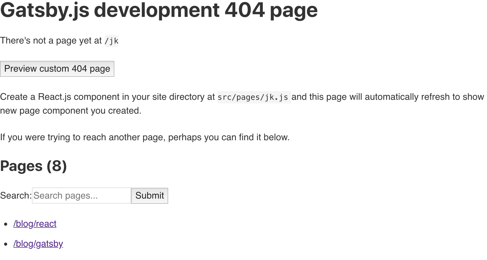
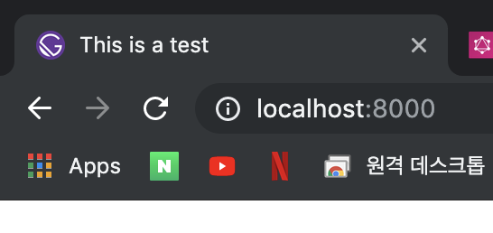
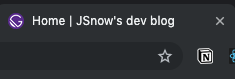

**[← 목록으로](https://github.com/snowjang24/gatsby-practice#-목록)**

# Gatsby와 React로 만드는 블로그

## ✏️페이지의 머리에 헬멧 씌우기

### 404 Page

만약 페이지 주소를 잘못 입력하였을 때 혹은 페이지 요청을 받아오지 못했을 때 404 Not found 페이지를 띄워줘야 한다. 404 페이지를 만들기 위해 `src/pages`에 `404.js`를 생성한다.

```javascript
import React from "react"
import { Link } from "gatsby"

import Layout from "../components/layout"

const NotFound = () => {
  return (
    <Layout>
      <h1>Page not found</h1>
      <p>
        <Link to="/">Head home</Link>
      </p>
    </Layout>
  )
}

export default NotFound
```

서버를 다시 실행하고 아무 틀린 주소를 입력하면 다음과 같이 나오는데, 이 페이지는 실제 프로덕트 페이지에서는 보이지 않는다. 직접 만든 404 page는 `Preview custom 404 page`를 클릭하여 확인가능하다. 



<br>

### React Helmet!

마지막으로 [React Helmet](https://github.com/nfl/react-helmet)을 사용해보려 한다. **React Helmet**은 페이지의 head(title, description 등 메타 데이터)에 대한 모든 변경 사항을 관리 한다.  [gatsby-plugin-react-helmet](https://www.gatsbyjs.org/packages/gatsby-plugin-react-helmet/)을 이용하면 쉽게 react-helmet을 적용할 수 있다. 

```bash
npm install gatsby-plugin-react-helmet react-helmet
```

`gatsby-config.js`를 다음과 같이 수정한다.

```javascript
// in gatsby-config.js
  plugins: [
    "gatsby-plugin-react-helmet",
```

모든 파일에 head를 만들어 줄 수도 있지만 그것보다는 페이지마다 동적으로 할당하는 것이 더 좋다. 따라서 `src/components`에 `head.js`를 생성한다. 테스트를 위해 간단하게 작성하였다.

```javascript
import React from "react"
import { Helmet } from "react-helmet"

const Head = () => {
  return <Helmet title="This is a test" />
}
  
export default Head
```

테스트를 위해 `src/pages/index.js`를 수정한다. 

```javascript
import React from "react"

import Layout from "../components/layout"
import Head from "../components/head"

const IndexPage = () => {
  return (
    <div>
      <Layout>
        <Head />
        <h1>Hello.</h1>
        <h2>I'm JSnow! Front-end developer, I'm learning React!</h2>
      </Layout>
    </div>
  )
}

export default IndexPage
```

올바르게 This is a test를 출력하고 있다. 여기서 favicon을 바꿔주고 싶다면, 루트 폴더의 `static/favicon.ico`를 수정하면 된다.



모든 페이지에 title이 This is a test면 이상할 것이기 때문에 좀 더 예쁘게 바꿔주고 싶다. 포스트면 포스트의 이름이 페이지면 각 페이지의 이름이 제목으로 표시되도록 바꿔주고 싶다. 그리고 내 블로그의 이름 또한 함께 나오게 하고 싶다.



`src/components`의 `head.js`를 다음과 같이 바꿔준다. `data.site.siteMetadata.title`을 통해 블로그 이름이 나오도록 만들었다. 그리고 앞에 페이지 이름은 title매개변수로 값을 받아와 나오도록 만들었다.

```javascript
import React from "react"
import { Helmet } from "react-helmet"
import { useStaticQuery, graphql } from "gatsby"

const Head = ({ title }) => {
  const data = useStaticQuery(graphql`
    query {
      site {
        siteMetadata {
          title
        }
      }
    }
  `)
  return <Helmet title={`${title} | ${data.site.siteMetadata.title}`} />
}
export default Head
```

모든 `src/pages`에 있는 페이지에 다음과 같이 title 값을 각 페이지에 맞게 전달한다.

```javascript
const AboutPage = () => {
  return (
    <Layout>
      <Head title="About" />
      <h1>About me</h1>
      <p>I'm just student who love front-end and design</p>
```

`src/templates`의 `blog.js`에도 다음과 같은 코드를 추가하여 각 포스트의 title이 페이지의 title로 들어갈 수 있게 만들어 준다.

```javascript
const Blog = props => {
  return (
    <Layout>
      <Head title={props.data.markdownRemark.frontmatter.title} />
      <h1>{props.data.markdownRemark.frontmatter.title}</h1>

```
