**[← 목록으로](https://github.com/snowjang24/gatsby-practice)**

# Gatsby와 React로 만드는 블로그

## ✏️Gatsby로 만든 페이지 배포하기

### Netlify를 이용한 배포

`.env.development`는 키 값 같은 다양한 데이터를 담고 있다. 여기서는 CONTENTFUL이란 라이브러리의 키값을 가지고 있지만 실제 연습에서는 사용하지 않았다.

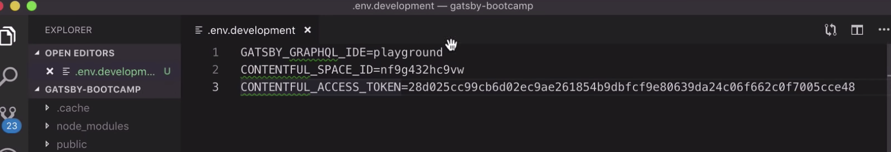

이 `.env.development`의 이름을 `.env`로 바꾼다. 그리고 `package.js` 에서 `scripts`부분도 수정한다.

```javascript
"scripts": {
    "build": "gatsby build",
    "develop": "env-cmd -f .env gatsby develop",
    "format": "prettier --write src/**/*.{js,jsx}",
```

그리고 필요한 git repository를 만들어주고 모든 파일을 업로드 한다.

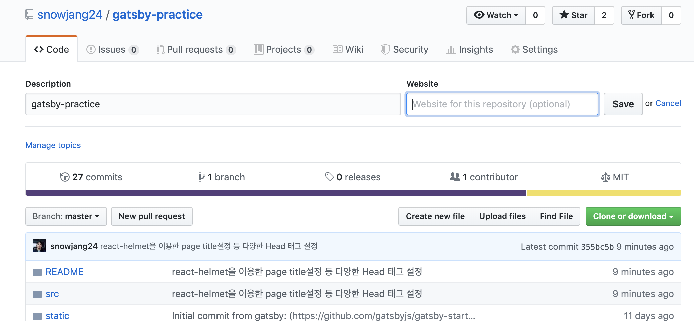

배포를 위해서는 [Netlify](https://www.netlify.com/)를 이용한다. 완전 무료다.

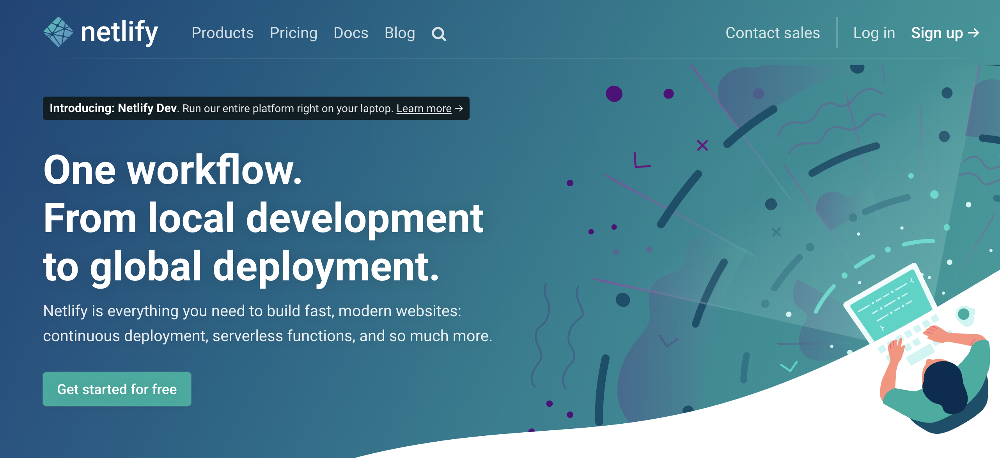

`New site from git`을 누른다.

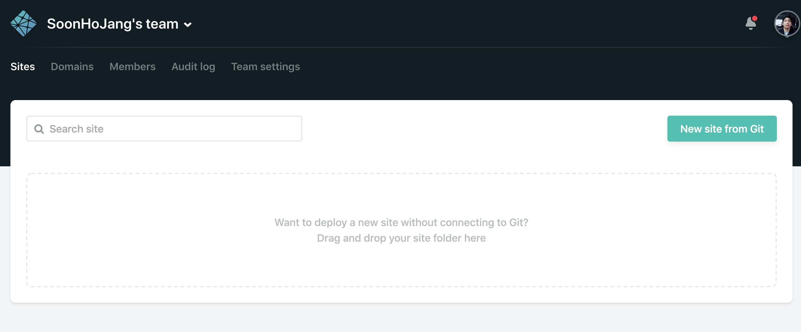

원하는 git provider를 선택한다.


모든 레포를 가져올지 딱 하나의 레포를 가져올지 정할 수 있다. 아까 만들었던 레포를 가져와 배포할 예정이기 때문에 Only select repositories에서 필요한 레포를 선택한다.

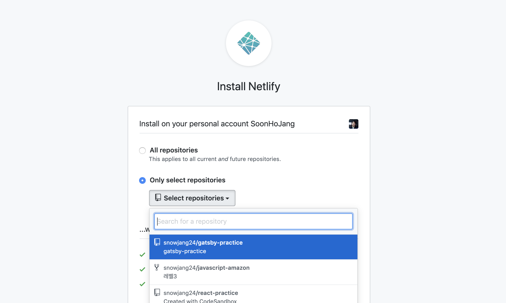

그리고 Install 하면 된다.

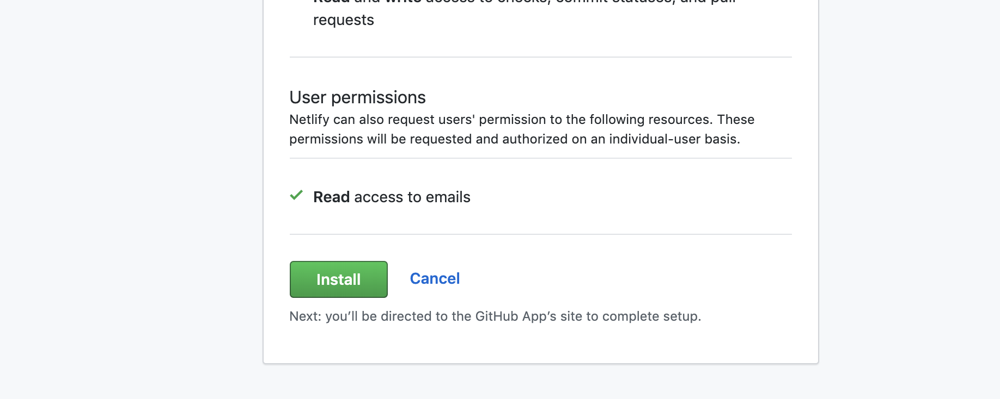

선택한 레포를 다시 클릭하면 세팅페이지로 넘어간다.

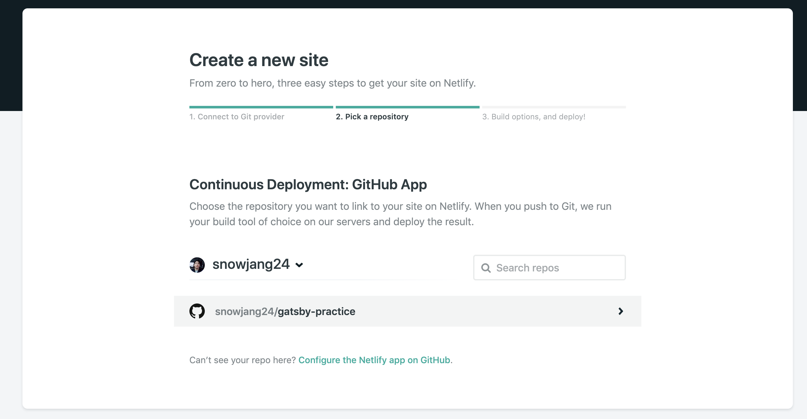

그런 다음 원하는 브랜치를 선택하여 배포할 수 있다. 필요하면 master말고 다른 브랜치를 두어 그 브랜치를 배포해도 된다. 다른 아래의 Basic build settings는 굳이 건드릴 필요가 없다.

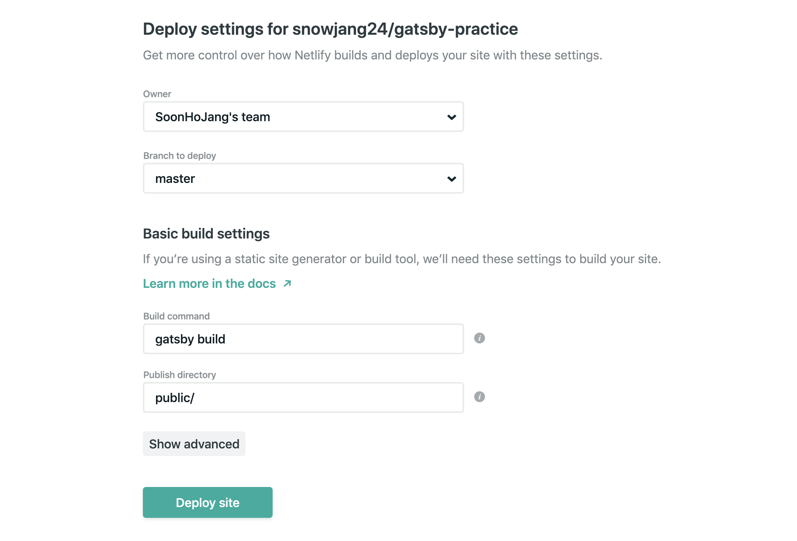

아래에 보면 Show advanced 버튼이 있는데 눌러서 아래와 같이 Advanced build settings를 할 수 있다. 여기서 New variable을 누르면 아래와 같이 Key value를 입력할 수 있는 칸이 나오는데 아까 .env파일과 동일하게 역할한다. 만약 필요한 access key가 있다면 이를 활용하여 값을 넘겨줄 수 있다.

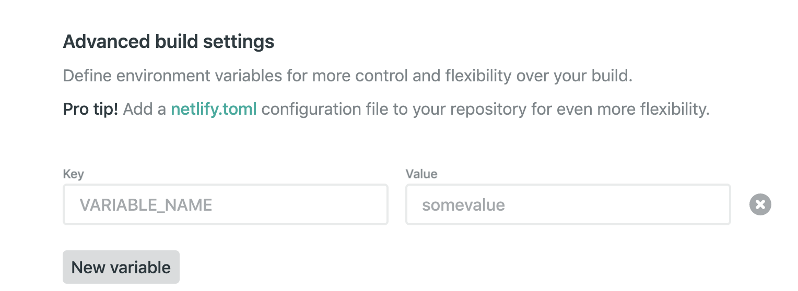

이제 디플로이중인 화면이 나오는데 시간이 조금 걸린다.

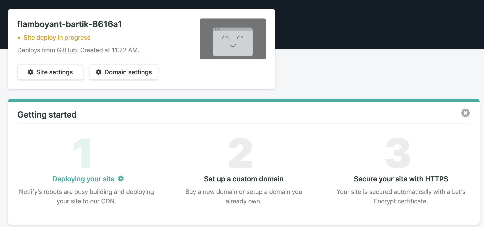

디플로이가 완료되면 페이지 주소가 나오는데 눌러서 접속하면 블로그가 디플로이 된 것을 확인할 수 있다.

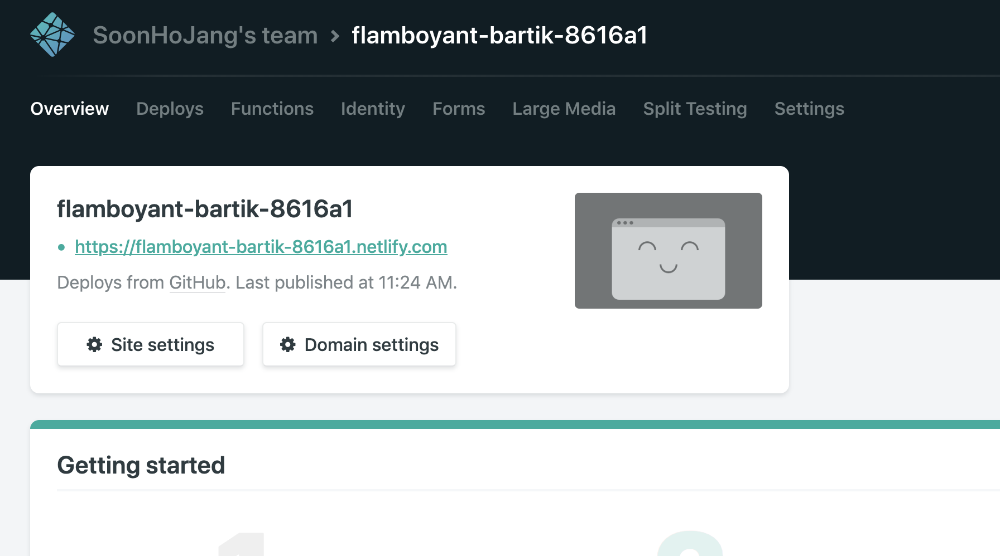

만약 데이터를 수정하고 데이터를 사이트에 반영하고 싶다면 아래와 같이 Deploys탭에 가서 Trigger deploy를 눌러  Clear cache and deploy site를 눌러 디플로이 할 수 있다.

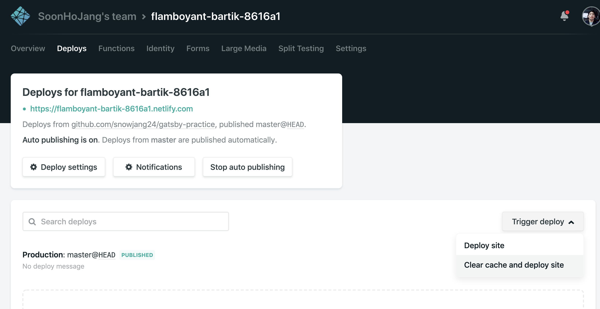

이보다는 우리가 잘 쓰는 로컬에서는 git에 수정사항을 다시 push 하면 자동으로 다시 Publish 된다.
